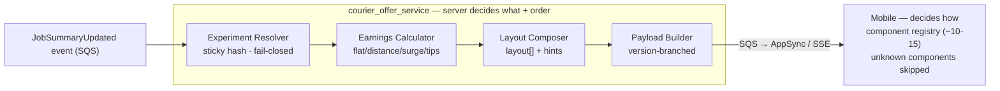

# ADR-001: Adopt Hybrid Server-Driven UI (Approach C) for the Courier Offer System

> 中文版：[`ADR-001-hybrid-sdui.md`](./ADR-001-hybrid-sdui.md)
>
> An Architecture Decision Record — a one-pager capturing *what* was decided, *why*, and *what was rejected*, so anyone who wasn't in the room (a new joiner, the PM, leadership) can follow the reasoning. It's the durable, written form of driving a decision through influence rather than authority.

---

- **Status:** Proposed (pending review board / mobile + backend sign-off)
- **Date:** 2026-05
- **Deciders:** Backend lead, Mobile lead, Principal engineer (review), Senior Technology Manager (informed)
- **Supersedes:** the hardcoded single `Offer.java` template

---

## Context

The courier offer system today is a **single hardcoded template** (`Offer.java`, 329 lines) that pushes an **identical** JSON payload to 50,000+ couriers across 15 countries. The business needs:
- A/B testing of different offer presentations
- Personalized earnings (tier / location / time of day / promotions)
- Gradual rollout (by city / segment / percentage)
- Multiple earning models (flat / distance / surge / tips prediction)

Hard constraints:
- **200ms p95 SLA** (today ~180ms → only ~20ms headroom)
- **2M offers/hour** peak (~556 RPS sustained, ~1500 peak)
- The system is already an **event-driven, distributed** architecture (SQS + Temporal + AppSync over AWS), and **already pushes structured JSON to mobile**

The team is split between two approaches:
- **Approach A** — server-side template engine + DSL; mobile is a dumb renderer
- **Approach B** — backend sends raw data; mobile owns all presentation logic

## Decision

Adopt **Approach C (Hybrid)**: the server controls the **layout (which components + order) + raw data + presentation hints**; mobile renders **natively** through a **bounded component registry (~10–15 components)**.

> One-line boundary: **the server decides *what* and *order*; mobile decides *how*.**



Payload shape:
```json
{
  "experiment": { "earnings_display": { "variant": "breakdown_v2", "group": "treatment" } },
  "layout": { "components": ["offer_header","earnings_breakdown","distance_summary","accept_cta"],
              "hints": { "highlight_field": "surge" } },
  "data":   { "earnings_breakdown": { "model": "surge", "base_pay": 450, "total": 730, "currency": "CAD" } }
}
```

## Consequences (honest, both ways)

**Positive**
- Most experiments (layout / order / hints) ship **without an app release** — we get A's experiment velocity
- **Native UX** (formatting, animation, RTL, dark mode owned by mobile) — we keep B's experience
- Light backend, easy to hold the 200ms SLA (only ~10ms added on-path)
- **Forward-compat**: mobile silently skips unknown components, so the server can ship ahead of the app
- A **natural evolution** of today's system (already pushing structured JSON), not a rewrite

**Negative / costs (state these proactively — it's a Staff signal)**
- Requires **upfront contract design** (backend + mobile jointly define component schemas)
- Requires **component governance** (a review board + versioning rules), or the registry sprawls
- **Changing an existing component's data shape still needs a release or dual-emit** — only *new* components get free forward-compat
- Old-app version negotiation: needs `min_app_version` + `fallback` (see `app-version-compatibility.md`)

## Alternatives considered

| Option | Why rejected |
|--------|--------------|
| **A — Template DSL** | The DSL becomes its own language to maintain/debug/test; server-side rendering eats latency at 2M/h and threatens the 200ms SLA; can't express native interactions, locks out mobile UX; backend becomes the bottleneck for every UI change |
| **B — Raw + Mobile** | Every layout experiment goes through an app-store release cycle; iOS/Android consistency is hard to guarantee; old apps don't understand new fields; mobile complexity grows unbounded |

## Mitigations for the mobile-complexity concern

The mobile team worries C adds complexity for them — **bounding** it is the key lever:
- A **locked component registry** (~10–15; additions go through both teams)
- **Shared schema → codegen** (one source generates Kotlin + Swift — no hand-parsing, no drift)
- **Forward-compat skip** (mobile can be ahead of / behind the server safely)
- **Component reuse** (one component reads many earning models → adding a model is backend-only)
- **Snapshot + integration tests** (a jointly-owned fixture set)
- **Co-owned RFC process** (mobile is a **co-author**, not a downstream consumer)

The full facilitation playbook is in `technical-leadership.md`.

## Validation / Rollout

Four phases, each reversible in seconds (no-op foundation → dual payload → flag rollout 1%→100% → experiments live). Metrics: p95/p99 latency, acceptance rate (per variant), dispute rate, crash rate, flag-fallback rate. See the Migration Strategy and Metrics in `hybrid-end-to-end-design.md`.

---

## Related

- `approach-evaluation.md` — full three-way comparison + industry references (Airbnb / Uber / Lyft / Grab)
- `hybrid-end-to-end-design.md` — end-to-end design, payload contract, migration, metrics
- `technical-leadership.md` — the 7-step playbook for bringing the mobile team to this decision
- `app-version-compatibility.md` — old-app compatibility playbook
