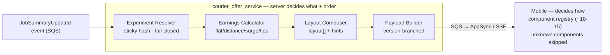

# ADR-001: Adopt Hybrid Server-Driven UI (Approach C) for the Courier Offer System

> **什么是 ADR**：Architecture Decision Record（架构决策记录）——一页纸,把"做了什么决定、为什么、放弃了什么"固化下来,
> 让没参会的人(未来新人、PM、leadership)都能读懂决策的来龙去脉。它是 Staff 用**影响力而非权威**驱动决策的实物证据。
>
> 面试用法：UC1 的「技术决策(#2)」和「技术领导力(#3)」可以共用这一页收口。讲的时候不要逐字念,放上一张 slide,口头讲 Context→Decision→为什么否决 A/B。

---

- **Status:** Proposed（待 review board / 移动+后端双方批准）
- **Date:** 2026-05
- **Deciders:** Backend lead, Mobile lead, Principal engineer(评审), Senior Technology Manager(知会)
- **Supersedes:** 现有硬编码 `Offer.java` 单模板

---

## Context（背景与约束）

快递员 Offer 系统当前是**单一硬编码模板**(`Offer.java`, 329 行),向 15 国 5 万+ 快递员推送**完全相同**的 JSON。业务需要:
- A/B 测试不同的 offer 展示
- 个性化收入计算(等级/位置/时段/促销)
- 灰度发布(按城市/分群/百分比)
- 多种收入模型(flat / distance / surge / tips prediction)

硬约束:
- **200ms p95 SLA**(今天 ~180ms → 仅 ~20ms headroom)
- **2M offers/hour** 峰值(~556 RPS sustained, ~1500 peak)
- 现系统已是 **event-driven 分布式架构**(SQS + Temporal + AppSync over AWS),且**已经在向移动端推结构化 JSON**

团队在两个方案间分裂:
- **Approach A** — 服务端模板引擎 + DSL,mobile 做哑渲染
- **Approach B** — 后端发原始数据,mobile 全权负责展示逻辑

## Decision（决策）

采用 **Approach C(Hybrid)**:服务端控制 **layout(哪些组件 + 顺序)+ raw data + presentation hints**;移动端通过**有界的 component registry(~10–15 个组件)**做**原生渲染**。

> 分界线一句话:**Server 决定 *what* 和 *order*,Mobile 决定 *how*。**



payload 形态:
```json
{
  "experiment": { "earnings_display": { "variant": "breakdown_v2", "group": "treatment" } },
  "layout": { "components": ["offer_header","earnings_breakdown","distance_summary","accept_cta"],
              "hints": { "highlight_field": "surge" } },
  "data":   { "earnings_breakdown": { "model": "surge", "base_pay": 450, "total": 730, "currency": "CAD" } }
}
```

## Consequences（后果，诚实列正负）

**正面**
- 大多数实验(layout/顺序/hints)**无需发版**——拿到了 A 的实验速度
- **原生 UX**(格式化、动画、RTL、暗黑模式由 mobile 掌控)——保住了 B 的体验
- 后端轻量,易守 200ms SLA(新增 on-path 仅 ~10ms)
- **forward-compat**:未知组件 mobile 静默跳过,server 可领先于 app 发布
- 是现状(已推结构化 JSON)的**自然演进**,不是推倒重来

**负面 / 代价(要主动说,这是 Staff 信号)**
- 需要**前期契约设计**(后端+移动共同定义组件 schema)
- 需要**组件治理**(review board + 版本规则),否则 registry 会失控
- **改已有组件的数据结构仍需发版或双发**——只有*新增*组件才有免费 forward-compat
- 老 app 版本协商:需 `min_app_version` + `fallback`(详见 `app-version-compatibility.md`)

## Alternatives considered（备选及否决理由）

| 方案 | 否决理由 |
|------|---------|
| **A — Template DSL** | DSL 自成一门要维护/调试/测试的语言;服务端渲染在 2M/h 下吃延迟、威胁 200ms;无法表达原生交互,锁死 UX;后端成为所有 UI 改动的瓶颈 |
| **B — Raw + Mobile** | 每个 layout 实验都要走 app store 发版周期;iOS/Android 一致性难保证;老 app 不认新字段;移动端复杂度无上限增长 |

## Mitigations for the mobile-complexity concern（回应移动团队顾虑）

移动团队担心 C 增加他们的复杂度——**有界化**是关键杠杆:
- 锁定的 component registry(~10–15 个,新增走双方评审)
- 共享 schema → codegen(一份源生成 Kotlin + Swift,无手写解析、无漂移)
- forward-compat skip(mobile 可领先/落后于 server 而安全)
- 组件复用(一个组件读多种 earning model,加模型=纯后端改动)
- 快照测试 + 集成测试(双方共有 fixture)
- co-owned RFC 流程(移动是**共同作者**,不是下游消费者)

详细推动过程见 `technical-leadership.md`。

## Validation / Rollout

分 4 阶段、每步可秒级回滚(no-op foundation → dual payload → flag rollout 1%→100% → 实验上线),指标含 p95/p99、acceptance rate(按 variant)、dispute rate、crash rate、flag fallback rate。详见 `hybrid-end-to-end-design.md` 的 Migration Strategy 与 Metrics。

---

## Related

- `approach-evaluation.md` — 三方完整对比 + 行业佐证(Airbnb / Uber / Lyft / Grab)
- `hybrid-end-to-end-design.md` — 端到端设计、payload 契约、迁移、指标
- `technical-leadership.md` — 推动移动团队达成此决策的 7 步法
- `app-version-compatibility.md` — 老 app 兼容 playbook
