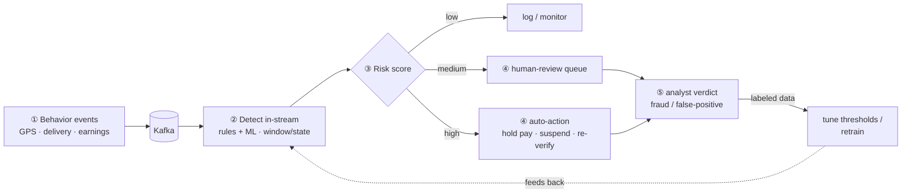

# RFC Skeleton — Real-time Fraud Detection (Use Case 2 coaching artifact)

> 中文版：[`RFC-skeleton-fraud-detection.md`](./RFC-skeleton-fraud-detection.md)
>
> **⚠️ This is deliberately NOT a finished RFC.**
>
> UC2 is about **providing technical guidance without doing the work for the team** (*guide without solving*). If, as the Staff engineer, I produced a *finished* RFC for their fraud system, I'd violate the core of the case — and the JD's *influence, not authority*.
>
> So what's here is: ① an **RFC skeleton (template)** for the team to fill in; ② the **reviewer questions I'd leave in each section**. It demonstrates *how I'd use the RFC process to teach the team to think*, not *me having thought it through for them*.
>
> **Interview use:** when covering UC2's "guidance strategy (#2)", show this and say: *"I won't write the RFC for them. I'll give them this skeleton with questions in each section; they fill the blanks with their answers — they write, I comment. The doc is both an artifact and skill-building."*

---

## How to use this skeleton (note to the team)

- **You write, I comment.** Each section starts with "questions to answer"; your answers become the RFC body.
- Fill §1–§3 first (align on problem & scope), then §4–§6 (technical), then §7–§8 (testing & plan).
- Don't skip a blank you can't fill — **the blank itself is a signal** that something needs measuring or discussing first.

---

## The loop you're building (overview)

> Real fraud detection is **not just "detection" — it's a closed loop.** This gives the team the whole picture: which step each section maps to.

> **Detection (②) is only one step** — ③ scoring, ④ tiered response, and ⑤ the feedback loop make the full system.
> The 3-day approach: get the **simplest single rule working end-to-end** (① → ② → log) first, then layer on ML / tiered response / feedback. See [`../en/fraud-detection-explained.md`](../en/fraud-detection-explained.md).

---

## §1. Problem & Goals

> **Team fills:** what are we detecting? what does success look like?

- Fraud patterns in scope (this cycle):
- Business impact / why now:
- Explicit **non-goals** (out of scope):

> 🧑‍🏫 **Reviewer asks:**
> - Of the 12 patterns, which **3 do stakeholders most want this quarter**? Who decided, and when?
> - If we shipped only the **original 3**, does the headline business outcome still hold?
> - How is "success" measured — precision/recall? alert volume? manual-review load?

## §2. Non-functional Requirements

> **Team fills:** hard targets for latency, throughput, accuracy.

- End-to-end latency target: (prompt says <5s, currently 45s)
- Event rate (**measured**, not guessed): avg ___ /s, peak ___ /s
- Acceptable false-positive / false-negative rates:

> 🧑‍🏫 **Reviewer asks:**
> - Is <5s a **real business need** or a guess? Does a fraud alert 30s late actually cause harm?
> - Have you **measured the real event rate**? (rough scale: 50k couriers × ~30/day ≈ ~20/s avg, ~100/s peak — but with GPS pings it could be far higher; measure it)
> - At that scale, **why Flink**? Its design point is 100k+/s — we may be 2–3 orders of magnitude under it. Answer this before picking the tool.

## §3. Scope & Phasing

> **Team fills:** which pattern(s) this cycle, and how the rest is sequenced.

> 🧑‍🏫 **Reviewer asks:**
> - Which pattern is **simplest and still proves the end-to-end pipeline**? (candidate: "marked complete >500m from destination" — data's already there, just a distance calc)
> - Can we **ship 1 first to prove the pipeline**, then add the rest?

## §4. Architecture

> **Team fills:** data-flow diagram (source → ingest → process → sink), component choices + rationale.

> 🧑‍🏫 **Reviewer asks:**
> - Walk the end-to-end data flow on a whiteboard — **does everyone draw the same thing**?
> - Where exactly do the 45s go (ingest / process / sink)? Is that **measured or assumed**?
> - Any **synchronous I/O** in an operator (DB lookups / HTTP)? What's the watermark / event-time strategy?
> - What's the parallelism? Any **hot key** saturating one partition? Checkpoint duration? Backpressure?
> - At this scale, could a **single stateful consumer + a KV store** meet <5s more simply? (Seriously evaluate the "simpler approach" — the engineer who wants to restart may be right.)

## §5. Data Quality Handling

> **Team fills:** what to do when location data is incomplete.

> 🧑‍🏫 **Reviewer asks:**
> - **What %** of events miss location? Distribution by city / courier? ("some" isn't actionable; "12% of CH" is)
> - What does "incomplete" mean — null / default / stale / missing entirely? **Different failure modes need different handling.**
> - Right behavior when missing — drop / flag suspicious / deadletter / hold for late arrival? (this is an unstated business rule — ask the PM)
> - Is the upstream fixable, or are we stuck handling it downstream? (decides "fix once" vs "handle forever")

## §6. Detection Rules

> **Team fills:** each rule's logic, thresholds, configurability.

> 🧑‍🏫 **Reviewer asks:**
> - Is a threshold (e.g. 500m) **hardcoded or configurable**? Who can change it?
> - Do rules interact / produce duplicate alerts?

## §7. Testing Strategy

> **Team fills:** how you test one rule end-to-end.

> 🧑‍🏫 **Reviewer asks:**
> - **Today**, how do you test one rule end-to-end? **Show me.**
> - Do you have a **known-fraud / known-clean labeled corpus**? Without it you can't measure precision/recall.
> - What's the **feedback loop** to change a rule — seconds / minutes / hours?
> - Is there **one** integration test: fixed input → assert output? (start with a 5–10 event positive+negative fixture)

## §8. Rollout & Metrics

> **Team fills:** how to roll out, monitor, and roll back.

> 🧑‍🏫 **Reviewer asks:**
> - Shadow mode (alert-only, no action) before enforce?
> - Monitoring: alert volume, false-positive rate, manual-review load, end-to-end latency
> - How do you kill a single rule in seconds if it misfires?

---

## §9. Alternatives Considered

> **Team fills:** options you considered but didn't pick, and why.

> 🧑‍🏫 **Reviewer asks:**
> - What does "restart with something simpler" concretely mean? **Write it up as a formal alternative and evaluate it**, not a throwaway in a meeting.
> - The Flink work is **not wasted** — it surfaced the data-quality, scope, and real-event-rate issues. Capture those as learnings.

---

## Coaching notes (Staff reminders to myself — not part of the RFC)

- **They write, I only comment.** Comments are **questions**, not conclusions ("what happens if this map is null?" not "add a null check").
- A section they can't fill = the topic for the next pairing / office-hours session.
- Over 60 days, have the team **rewrite a v2 RFC based on what they've learned** — that's knowledge transfer (see the 30/60/90 in `team-guidance-use-case-2.md`).
- Stay in sync with the **Tech Manager** throughout: architecture runs through me, scope/scheduling is theirs.

---

## Related

- `team-guidance-use-case-2.md` / `.zh.md` — full UC2 answer (diagnose / guide / 3-day / knowledge transfer / working with the TM)
- `presentation-outline.md` — slides for UC2 map to these sections
