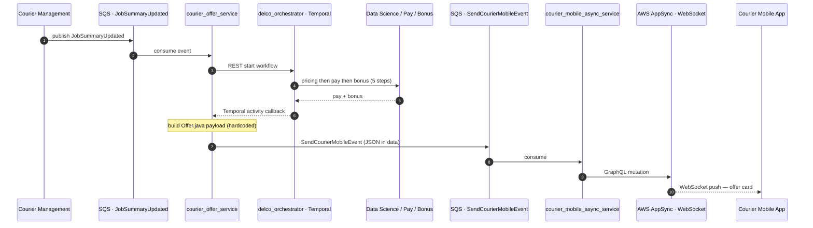

# Courier Offer System - Current Architecture

## Overview

The courier offer system delivers job opportunities to 50,000+ active couriers across 15 countries. The current implementation follows an asynchronous event-driven architecture using Temporal workflows for orchestration.

## Repositories

| Repo | Location | Purpose |
|------|----------|---------|
| `courier_offer_service` | `~/Documents/Git2/couriers/services/courier_offer_service` | Assembles offer payload, implements Temporal activities, publishes offer events |
| `delco_orchestrator` | `~/Documents/Git2/couriers/services/delco_orchestrator` | Temporal workflow orchestrator — coordinates pay/bonus calculations |
| `courier_mobile_async_service` | `~/Documents/Git2/couriers/services/courier_mobile_async_service` | Transport layer — forwards offers to mobile via AWS AppSync |
| `temporal_multiverse` | `~/Documents/Git2/couriers/services/temporal_multiverse` | Shared Java library — Temporal activity interfaces and utilities |

## End-to-End Async Flow

### Event Flow (rendered)

> 事件驱动的端到端时序。每条箭头是一次**异步事件**或调用——没有任何一步是同步阻塞 mobile 的。



### Detailed System Diagram

```
┌──────────────────────────────────────────────────────────────────────────────────┐
│                           CURRENT OFFER SYSTEM FLOW                               │
└──────────────────────────────────────────────────────────────────────────────────┘

┌─────────────┐         ┌─────────────────────┐         ┌─────────────┐
│ Skynet/HAL  │────────▶│  Courier Management │────────▶│  Adjutant   │
│ (Assignment)│         │  (Job tracking)     │◀────────│ (Feasibility│
└─────────────┘         └─────────────────────┘         └─────────────┘
                                  │
                                  │ "Job Summary Updated" (SQS)
                                  ▼
┌──────────────────────────────────────────────────────────────────────────────────┐
│  courier_offer_service (Quarkus / Java)                                          │
│                                                                                  │
│  ┌─────────────────────┐    ┌──────────────────────────────────┐                 │
│  │ JobSummaryUpdated    │───▶│ AbstractOfferService             │                 │
│  │ Handler              │    │ .processAsyncOffers()            │                 │
│  └─────────────────────┘    └──────────────────────────────────┘                 │
│                                        │                                         │
│                                        │ REST: POST /workflow/courier-offer/start │
└────────────────────────────────────────┼─────────────────────────────────────────┘
                                         │
                                         ▼
┌──────────────────────────────────────────────────────────────────────────────────┐
│  delco_orchestrator (Temporal Workflow)                                           │
│                                                                                  │
│  ┌────────────────────────────────────────────────────────────────────────────┐  │
│  │  CourierOfferWorkflowImpl.processCourierOffer()                            │  │
│  │                                                                            │  │
│  │  Step 1: sendCreatePricingRates() ──────────────▶ Data Science             │  │
│  │           (triggers pricing calculation)          (Courier Pricing)         │  │
│  │                                                                            │  │
│  │  Step 2: Workflow.await(1.5s) ◀─── signal ─────── PricingRatesCreated      │  │
│  │           (wait for pricing result)                                        │  │
│  │                                                                            │  │
│  │  Step 3: calculateCourierPay() ─────────────────▶ Courier Pay Service      │  │
│  │           (get pay breakdown)                                              │  │
│  │                                                                            │  │
│  │  Step 4: calculateBonusesAndIncentives() ───────▶ Courier Bonus Service    │  │
│  │           (get bonuses, failures OK)                                       │  │
│  │                                                                            │  │
│  │  Step 5: publishOfferInformation() ─────────────▶ courier_offer_service    │  │
│  │           (send pay+bonus back)                   (activity worker)        │  │
│  └────────────────────────────────────────────────────────────────────────────┘  │
└──────────────────────────────────────────────────────────────────────────────────┘
                                         │
                                         │ callback (Temporal activity)
                                         ▼
┌──────────────────────────────────────────────────────────────────────────────────┐
│  courier_offer_service                                                           │
│                                                                                  │
│  ┌──────────────────────┐    ┌─────────────────┐    ┌────────────────────────┐   │
│  │ CourierOfferActivities│───▶│ OfferApi        │───▶│ Offer.java (HARDCODED) │   │
│  │ Impl.publishOffer()  │    │ .sendOffer()    │    │ - Jobs (22 fields)     │   │
│  └──────────────────────┘    └─────────────────┘    │ - Fees (8 fields)      │   │
│                                                     │ - Address (10 fields)  │   │
│                                                     │ - DeliveryDetails      │   │
│                                                     └────────────────────────┘   │
│                                                              │                   │
│                                                              │ JSON serialize    │
│                                                              ▼                   │
│                                                     ┌────────────────────────┐   │
│                                                     │ EventPublishingService │   │
│                                                     │ → SendCourierMobile    │   │
│                                                     │   Event (SQS)         │   │
│                                                     └────────────────────────┘   │
└──────────────────────────────────────────────────────────────────────────────────┘
                                         │
                                         │ SQS: SendCourierMobileEvent
                                         ▼
┌──────────────────────────────────────────────────────────────────────────────────┐
│  courier_mobile_async_service                                                    │
│                                                                                  │
│  ┌─────────────────┐    ┌──────────────────────┐    ┌────────────────────────┐   │
│  │ MobileEventApi  │───▶│ BrokerageService     │───▶│ AWSAppSyncService     │   │
│  │ (SQS consumer)  │    │ (reliability/ack)    │    │ (WebSocket push)      │   │
│  └─────────────────┘    └──────────────────────┘    └────────────────────────┘   │
└──────────────────────────────────────────────────────────────────────────────────┘
                                         │
                                         │ WebSocket (AppSync)
                                         ▼
                              ┌─────────────────────┐
                              │   Courier Mobile    │
                              │   App (iOS/Android) │
                              │                     │
                              │   Renders fixed     │
                              │   offer card from   │
                              │   JSON payload      │
                              └─────────────────────┘
```

### External Services

```
┌──────────────────────────────────────────────────────────────────────────────────┐
│                           EXTERNAL SERVICES                                       │
├─────────────────────┬────────────────────────────────────────────────────────────┤
│ Data Science        │ Calculates suggested pay (Courier Pricing)                 │
│ Courier Pay         │ Persists & serves pay calculations                         │
│ Courier Bonus       │ Calculates bonuses & incentives                            │
│ Adjutant            │ Job feasibility analysis (costs, assignments)              │
│ Dispatch Logistics  │ Links deliveries, determines pooling (SPP/MPP/ITP/CJF)    │
│ Skynet/HAL          │ Courier-to-delivery matching & assignment                  │
└─────────────────────┴────────────────────────────────────────────────────────────┘
```

## Key Files

### courier_offer_service

| File | Purpose |
|------|---------|
| `infrastructure/events/dto/out/Offer.java` | **The hardcoded offer template** — fixed JSON payload shape (329 lines of nested Java records) |
| `infrastructure/events/handlers/JobSummaryUpdatedHandler.java` | Entry point — consumes the event from Courier Management |
| `infrastructure/events/EventPublishingService.java` | Serializes Offer to JSON, publishes `SendCourierMobileEvent` to SQS |
| `infrastructure/temporal/activities/CourierOfferActivitiesImpl.java` | Temporal activity worker — implements `sendCreatePricingRates` and `publishOfferInformation` |
| `infrastructure/rest/clients/DelcoOrchestratorClient.java` | REST client to start workflows and signal pricing rates |
| `infrastructure/rest/clients/CourierPayServiceClient.java` | REST client to Courier Pay |
| `infrastructure/rest/clients/CourierBonusServiceClient.java` | REST client to Courier Bonus |
| `domain/offer/AbstractOfferService.java` | Core domain logic — `processAsyncOffers()`, `sendCourierMobileEvent()` |
| `infrastructure/events/sqs/SqsEventModule.java` | SQS event subscriptions and command publishing configuration |

### delco_orchestrator

| File | Purpose |
|------|---------|
| `infrastructure/temporal/CourierOfferWorkflowImpl.java` | **The workflow definition** — orchestrates the 5-step offer assembly |
| `domain/workflow/CourierOfferWorkflow.java` | Workflow interface |
| `infrastructure/temporal/ActivityStubsProvider.java` | Creates Temporal activity stubs for remote services |
| `infrastructure/resources/CourierOfferWorkflowController.java` | REST endpoint: `POST /workflow/courier-offer/start` |

### courier_mobile_async_service

| File | Purpose |
|------|---------|
| `api/dto/in/SendCourierMobileEvent.java` | Event DTO: `courierId`, `subject`, `time`, `data` (JSON string) |
| `api/MobileEventApi.java` | Consumes event, delegates to brokerage service |
| `infrastructure/appsync/AWSAppSyncService.java` | Pushes to AWS AppSync WebSocket |

## The Hardcoded Offer Template (Offer.java)

The single rigid payload sent to all couriers:

```java
record Offer(
    Jobs jobs,                                    // ongoing, offers, queued
    Integer remainingJobs,
    Optional<OrderAcceptanceTimes> orderAcceptanceTimes,
    Optional<TopUpPromotion> topUpPromotion,
    List<DeliveryDetails> deliveries
)
```

Each `JobDetails` contains 22 fields including:
- `courierId`, `jobType`, `deliveryId`, `orderNumber`, `amount`
- `Address` (10 fields)
- `Fees` (tip, deliveryFee, subsidy, driveScoreSubsidy, reimbursements, jobPay, bonuses, distanceExpensesAllowance)
- `ProofOfDeliveryDetails`
- `offerType`, `clientType`, `returnType`

### Sample Payload → UI Mapping

> **Note on sources.** `sample-offer-payload.json` is a real `JobSummaryUpdated` capture from a CH (Bern) test session. The two screenshots (`offer-screen-collapsed.png`, `offer-screen-expanded.png`) are from a separate CA (Calgary) test session and are *not* derived from this JSON — that's why the addresses below ("Calgary The First", Edmonton, Calgary) don't appear in the JSON file (which has Bern/Switzerland addresses). The mapping is illustrative: it shows which payload *fields* drive which UI elements, using the screenshots' visible values for clarity. Whether a future capture matches both at once is an open verification item — see `handOver.md`.

```
PAYLOAD FIELD                              →  UI ELEMENT
─────────────────────────────────────────────────────────────────────────
jobOffers[0].restaurantName                →  "1 pickup: Calgary The First"
jobOffers[0].destination.address1          →  "11200 37 Street SW, Edmonton"
jobOffers[0].destination.latitude/longitude →  Map pin A (pickup)
jobOffers[0].time (computed ETA)           →  "Arrive at 2:12 PM"
jobOffers[0].fees.tip (250 = $2.50)        →  "Includes tip" label
jobOffers[0].distance (2590m)              →  ─┐
jobOffers[1].distance (3766m)              →  ─┤→ "7.7 km" (total: 2590+3766 ÷ 1000 ≈ 6.4km*)
                                                   (* UI shows 7.7km, likely route distance)
jobOffers[1].destination.name              →  "1 delivery: DataTest"
jobOffers[1].destination.address1          →  "2631 17 Ave SW, Calgary"
jobOffers[1].destination.latitude/longitude →  Map pin B (delivery)
jobOffers[1].destination.specialInstructions → "Note from DataTest: Hello!"

orderAcceptanceTimes.expirationTimestamp   →  Countdown timer "0:40"
  - viewedTimestamp                        →  (start time for countdown)

fees (aggregated across jobs)              →  "$9.76" (total earnings)
  - fees.tip = 250 ($2.50 per job × ?)    →  "Transit pay + stated tip: $9.76"

jobOffers.length = 2 (COLLECT + DELIVER)   →  "2 stops"
offerType = "STANDARD"                     →  (no pooling badge shown)
alcoholDelivery = false                    →  (no alcohol warning)
isShopAndPay = false                       →  (no shop-and-pay badge)
```

### Key Observations from Real Payload

1. **Earnings are NOT in this payload** — `amount: 0` and `fees.jobPay: 0`. The actual $9.76 comes from Courier Pay service (via Temporal workflow). This payload is the `JobSummaryUpdated` event consumed by `courier_offer_service`. The final `SendCourierMobileEvent.data` payload is built afterward and includes the pay/bonus values; whether its top-level shape is identical to this `JobSummaryUpdated` JSON or a different envelope is an open verification item — see `handOver.md`.

2. **Two jobs per delivery** — COLLECT + DELIVER pair for same `deliveryId`. Mobile combines them into "2 stops."

3. **Distance is per-job** — `distance: 2590` (collect) + `distance: 3766` (deliver) = raw 6.4 km straight-line. UI shows 7.7 km. Hypothesis: UI uses route distance from the mapping service rather than the raw `distance` field. Confirm against the actual mobile rendering code — see `handOver.md`.

4. **Customer note = specialInstructions** on DELIVER job destination.

5. **Acceptance rate / progress bar** — NOT in this payload. Comes from a separate courier profile/stats call.

6. **Order number** — JSON has `orderNumber: 173847`; the screenshot's expanded view shows "Order #100373735". These are from different captures (see "Note on sources" above), so the mismatch is expected here — but the underlying question of *which field* feeds the on-screen "Order #" string still needs to be confirmed against the mobile code. Hypothesis: external order ID from `orderId` UUID or a separate field. See `handOver.md`.

### Screenshots

- `offer-screen-collapsed.png` — half-sheet view with map + summary
- `offer-screen-expanded.png` — full-sheet with earnings breakdown, customer note, acceptance rate

### Problems with Current Template
- Fixed structure — no way to vary fields per experiment/courier/region
- No experimentation hooks (no variant field, no feature flags)
- Presentation coupled to data — backend dictates exactly what mobile renders
- Any change requires full deployment across all regions

## Offer Types (from Courier Management)

| OfferType | Description |
|-----------|-------------|
| `STANDARD` | Single collect + deliver pair |
| `ITP` | In-Transit Pooling — extra job while en route to partner |
| `CJF` | Continuous Job Flow — subsequent job while en route to customer |
| `MULTI_COLLECT` | Single Partner Pooling (same restaurant) |
| `MPP` | Multi-Partner Pooling (different restaurants) |

## System Roles

| System | Responsibility |
|--------|---------------|
| **Skynet/HAL** | Job assignment — matches couriers to deliveries |
| **Dispatch Logistics** | Links deliveries into sequences, determines pooling |
| **Courier Management** | Interprets job structures, tracks PoolingState, publishes events |
| **Courier Offer Experience** | Determines offer presentation based on OfferType (currently inside Courier Management) |
| **Courier Pricing (Data Science)** | Calculates suggested pay rates |
| **Courier Pay** | Persists and serves pay calculations |
| **Courier Bonus** | Calculates bonuses and incentives |
| **Adjutant** | Job feasibility analysis (runs every 60s or on-demand) |

## Technical Stack

- **Language:** Java
- **Framework:** Quarkus (with SmallRye Mutiny for reactive)
- **Orchestration:** Temporal (via DELCO Orchestrator)
- **Messaging:** AWS SQS
- **Push to mobile:** AWS AppSync (WebSocket)
- **Service communication:** MicroProfile REST Client

## Performance Constraints

- Response time SLA: 200ms (p95), currently measured at 180ms (verification needed — see `handOver.md`)
- **Effective headroom for new work: ~20ms.** Any new on-path component (experiment resolver, layout composer, earnings calculator, payload builder) must fit inside this. Designs that claim 20ms of new work *and* 20ms of safety margin are double-counting — there is one bucket of 20ms.
- Peak throughput: 2M offers/hour (~556 RPS)
- Temporal workflow pricing signal timeout: 1.5s
- DELCO Orchestrator REST timeout: 2s with 3 retries (exponential backoff)
## Confluence References

- [Understanding The Offer Logic in Courier Management](https://justeattakeaway.atlassian.net/wiki/spaces/jobflow/pages/7670400197)
- [Courier Offer Sync and Async Flow](https://justeattakeaway.atlassian.net/wiki/spaces/COE/pages/7142703560)
