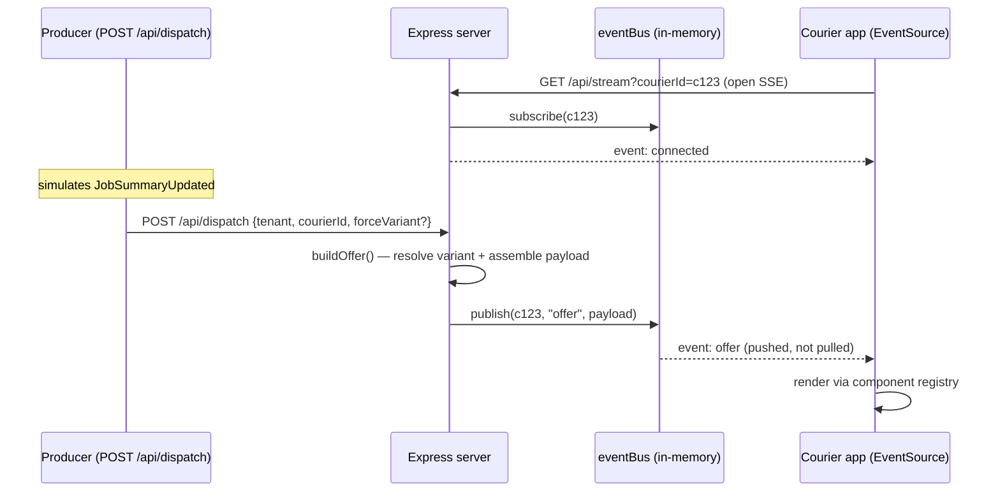

# Offer Hybrid Demo

A working demo of the **hybrid server-driven UI** pattern from
[`hybrid-end-to-end-design.md`](../hybrid-end-to-end-design.md). Stack:
React + Vite (frontend) and Express (backend).

It models a courier offer screen — the same kind of "$9.76 / 7.7 km / Accept"
card you'd see in a delivery driver app — and demonstrates two design ideas at
once:

1. **Server-driven layout**: backend tells mobile *which components to render
   in what order*, mobile decides *how each component looks*. Layout changes
   ship without an app release.
2. **Sticky per-courier A/B variants**: the same courier always lands in the
   same variant of an experiment, via a deterministic hash. No flag service or
   database needed for the demo.

---

## Quick start

```bash
cd demo/
npm install
npm run dev
```

Two processes start under one command (via `concurrently`):

| Process | Port | What |
|---|---|---|
| Express server | `3001` | API: `/api/...` |
| Vite dev server | `5173` (or `5174` if 5173 is taken) | React app, proxies `/api/*` to `:3001` |

Open whichever port Vite logs and visit:

- **Admin** — `http://localhost:5174/admin`
- **Client** — `http://localhost:5174/client`

To stop everything later: `lsof -ti :3001,:5174 | xargs kill`.

> **Storage note.** The server persists configs to `server/data/configs.json`
> via plain file writes. There is no database. Sample offer fixtures live in
> `server/data/sample-offers.json`. Both files are pretty-printed JSON and
> safe to inspect or edit by hand while the server is running.

---

## What this demo proves

### Proof 1 — Server-driven layout (no app release)

> "Reorder the components on the courier's screen" = edit a JSON config
> on the backend, not the app.

Steps to see it:

1. Open Admin, pick **CA**, click the **treatment** tab.
2. Drag `surge_indicator` and `earnings_breakdown` around. Change earnings
   model to `surge`. Add a hint `theme=urgent`.
3. The right-hand phone preview updates within ~120 ms — that's the layout
   change rendered through the same React components as the production
   client.
4. Click **Save config**.
5. Open Client, pick **CA**, courier ID `c999`, variant `auto`. The phone
   reflects the saved treatment layout.

There was no app build, no app store release, no deploy. The mobile app
(here, the Client page) reads `layout.components[]` from the server payload
and looks up each name in its component registry.

### Proof 2 — Sticky per-courier variant assignment

> "Same courier, same variant — every time, no matter how many offers."

The Experiment Resolver hashes `courierId + experimentId` deterministically
and compares the bucket (0–99) against `treatment_pct`. Same input → same
bucket → same variant.

Try it from the Client page (or directly via curl):

```bash
# Same courier, three calls — same bucket, same variant
for i in 1 2 3; do
  curl -s "http://localhost:3001/api/offer/CA?courierId=c123" \
    | python3 -c "import json,sys;a=list(json.load(sys.stdin)['experiment']['assignments'].values())[0];print(a['variant'], a['bucket'])"
done
```

Different couriers land in different buckets and split per `treatment_pct`:

```bash
for cid in alice bob carol dan eve frank; do
  curl -s "http://localhost:3001/api/offer/CA?courierId=$cid" \
    | python3 -c "import json,sys,os;a=list(json.load(sys.stdin)['experiment']['assignments'].values())[0];print(os.environ.get('cid',''), a['variant'], a['bucket'])" cid="$cid"
done
```

You can also force a variant for previewing:
`?courierId=c123&forceVariant=treatment`. The response tags
`source: "override"` so it's clearly distinct from a real assignment.

---

## Features

### Admin page (`/admin`)

Three columns:

| Column | What's there |
|---|---|
| **Left** | Tenant selector · `experiment_id` · `treatment_pct` slider · Save button · collapsible saved-config JSON |
| **Middle** | `control` / `treatment` tabs · drag-and-drop layout list (Add/Remove available components) · earnings model dropdown · distance unit · free-form hints editor |
| **Right** | **Live phone previews** for both variants, side-by-side. The frame for the variant tab you're editing has a blue accent border so you don't lose track of which one your edits are affecting. |

Edits drive a debounced `POST /api/offer/:tenant/preview` call so the previews
update *before* you save. The Client page only sees changes after **Save
config**, which is the production behaviour you want.

### Client page (`/client`) — event-driven

The client opens an **SSE stream** and waits for offers to be **pushed**.

| Control | What it does |
|---|---|
| **Connection dot** | Live SSE status: connecting / connected / reconnecting, with the courier the stream is bound to |
| **Tenant selector** | Pick CH / UK / CA — chosen when you dispatch (different sample offer + tenant config) |
| **Courier ID input** | The deterministic-hash input; **changing it re-opens the stream**. Try `c123` vs `c999` for different bucket assignments. |
| **Variant toggle** | `auto` (use the hash), `control` / `treatment` (force via `forceVariant`, tagged `source: "override"`) |
| **⚡ Dispatch offer** | Simulates a `JobSummaryUpdated` event → backend assembles → **pushes** down the stream (disabled until the stream is connected) |
| **Event log** | Timestamped list of pushed offers (tenant · variant · source) |
| **Phone frame** | Shows "Waiting for an offer…" until an event arrives, then renders the pushed offer |
| **Payload inspector** | Highlights `experiment.assignments` at the top, then full JSON below |

### Component registry & the `v2` pattern

`src/components/offer/OfferRenderer.jsx` exports a single `REGISTRY` object
mapping component names to React components:

```js
export const REGISTRY = {
  route_map: RouteMap,
  earnings_total: EarningsTotal,
  earnings_total_v2: EarningsTotalV2,   // alternate UI for the same data
  earnings_breakdown: EarningsBreakdown,
  distance_summary: DistanceSummary,
  stop_details: StopDetails,
  ...
};
```

The layout config from the server is just a list of these names. Unknown
names render as a small dashed orange placeholder ("unknown component:
foo — skipped on production build") rather than crashing — that's the
forward-compat pattern: mobile can be ahead or behind the server's
component vocabulary safely.

`earnings_total_v2` is included as a worked example of the **same data,
different UI** pattern. v1 shows `$11.26 / Includes tip`; v2 shows pay and
tip in side-by-side cards with a gradient total below. Both read the same
`data.earnings` object — the server doesn't know which one is rendering.

To add another v2 (e.g., `accept_cta_v2` for swipe-to-accept):
1. Create the new React component.
2. Add it to `REGISTRY` in `OfferRenderer.jsx`.
3. Add its name to `ALL_COMPONENTS` in `ComponentList.jsx` so admins can
   select it.
4. If the component needs a data block that wasn't already on the wire,
   add a `has('your_component')` check in `server/lib/assemble.js` `buildData()`.

---

## How to walk through the demo (5-minute tour)

1. **`npm run dev`**, open both `/admin` and `/client` in adjacent windows.
2. On Admin, **CA** tenant, **treatment** tab. Drop in `earnings_total_v2`
   from the Available list and Remove `earnings_breakdown`. Set
   `highlight=tip`. Watch the right phone preview redraw with a
   side-by-side pay/tip card.
3. Slide `treatment_pct` to 50. The slider's caption now reads
   "50% see treatment · 50% see control".
4. Click **Save config**.
5. On Client, courier `c123`, variant `auto`. Wait for the connection dot to
   turn green, then hit **⚡ Dispatch offer** — the offer is *pushed* down the
   SSE stream and the phone redraws. Inspector shows `bucket: 95` → control.
   Switch courier to `c999` (stream re-opens) → dispatch → `bucket: 2` →
   treatment. Try the variant override to flip and confirm `source: "override"`.
6. Back to Admin. Slide `treatment_pct` down to 0, save. On Client, dispatch
   again — even `c999` now shows control (the rollout was killed). This is the
   "instant rollback" property.

---

## Architecture

```
┌─────────────────────────────────┐         ┌─────────────────────────────────┐
│  Admin Page (React)             │         │  Client Page (React)            │
│  - Edit control variant         │         │  - Opens SSE stream (EventSource)│
│  - Edit treatment variant       │         │  - ⚡ Dispatch offer (event)     │
│  - Live phone previews          │         │  - Phone frame (offer pushed in)│
│  - Save config                  │         │  - Event log + payload inspector│
└─────────────────────────────────┘         └─────────────────────────────────┘
       │                                       │  ▲ SSE: event: offer (push)
       │ PUT /api/config/:tenant               │  │
       │ POST /api/offer/:tenant/preview       │  │ GET /api/stream?courierId=
       │                          POST /api/dispatch  │
       ▼                                       ▼  │
┌──────────────────────────────────────────────────────────────────────────────┐
│  Express server (simulates the real Java services)                           │
│                                                                              │
│  /api/courier-pay/:deliveryId    → mock Courier Pay Service                  │
│  /api/courier-bonus/:courierId   → mock Courier Bonus Service                │
│  /api/experiment/:courierId      → deterministic-hash Experiment Resolver    │
│  /api/offer/:tenant              → assembles modular payload (pull path)     │
│  /api/offer/:tenant/preview      → assembles for an unsaved variant          │
│  /api/dispatch                   → event producer: assemble + publish to bus │
│  /api/stream                     → SSE: pushes offer events to a courier     │
│  /api/config/:tenant (GET, PUT)  → load/save layout configs                  │
│  /api/tenants                    → list tenants                              │
│                                                                              │
│  lib/assemble.js (shared build)  ·  lib/eventBus.js (in-memory pub/sub)      │
│  Storage: server/data/configs.json + sample-offers.json                      │
└──────────────────────────────────────────────────────────────────────────────┘
```

### Event-driven path (SSE) — the courier app gets offers *pushed*

The client page does **not** poll. It opens a long-lived **Server-Sent Events**
stream and renders offers as they are pushed — the demo's stand-in for the real
AppSync WebSocket. "Dispatch offer" simulates a `JobSummaryUpdated` event
arriving at the backend.



**Why SSE, not WebSocket?** Offer delivery only needs **server → client**. The
courier's accept/decline goes back over a normal `POST` (a separate channel),
so WebSocket's bidirectional complexity isn't needed. SSE is plain HTTP, has
built-in auto-reconnect, and is far simpler to operate. (The real JET system
uses AppSync/WebSocket — in the interview, present SSE as a lighter alternative
*if starting from scratch and only one-directional push is required*, while
acknowledging the existing AppSync investment.)

Producer and consumer are **fully decoupled**: `POST /api/dispatch` publishes to
the bus and reports how many open streams received it (`delivered`) — it neither
knows nor cares who is listening. The pull endpoint (`GET /api/offer`) still
exists and reuses the **exact same** `buildOffer()` assembly, so transport never
changes the payload.

### How it maps to the real production system

| Real system | Demo equivalent |
|---|---|
| Courier Pay Service | `/api/courier-pay` (mock data) |
| Courier Bonus Service | `/api/courier-bonus` (mock data, also serves acceptance rate) |
| Courier profile / acceptance-rate source | Folded into bonus mock for simplicity |
| Experiment Resolver / feature flag service | `/api/experiment` (deterministic hash, override-able) |
| `delco_orchestrator` (Temporal) | Implicit — `buildOffer()` calls pay+bonus internally |
| `courier_offer_service` | `/api/offer` + `/api/dispatch` (composition + layout assembly) |
| SQS event (`JobSummaryUpdated`) | `POST /api/dispatch` (the event producer) |
| SQS → `courier_mobile_async_service` → AppSync (WebSocket push) | `eventBus` → `/api/stream` (SSE push) |
| Courier app WebSocket subscription | Client opens an `EventSource` on `/api/stream` |
| Layout / experiment config | `/api/config/:tenant` |

---

## API reference

| Method | Path | Purpose |
|---|---|---|
| `GET` | `/api/tenants` | List configured tenants |
| `GET` | `/api/config/:tenant` | Load saved tenant config |
| `PUT` | `/api/config/:tenant` | Save tenant config (full replace) |
| `GET` | `/api/courier-pay/:deliveryId` | Mock pay response |
| `GET` | `/api/courier-bonus/:courierId` | Mock bonus + acceptance rate |
| `GET` | `/api/experiment/:courierId?experimentId=&treatmentPct=&forceVariant=` | Resolve a single experiment |
| `GET` | `/api/experiment/:courierId?tenant=&forceVariant=` | Resolve using saved tenant config |
| `GET` | `/api/offer/:tenant?courierId=&forceVariant=` | Assembled offer payload for the resolved variant (pull path) |
| `POST` | `/api/offer/:tenant/preview` | Assemble for an unsaved variant (admin previews) |
| `GET` | `/api/stream?courierId=` | **SSE** stream — server pushes `offer` events to this courier |
| `POST` | `/api/dispatch` body `{tenant,courierId,forceVariant?}` | **Event producer** — assemble + push an offer to open streams; returns `{delivered, subscribers}` |

Sample offer payload returned by `/api/offer/:tenant`:

```json
{
  "version": 2,
  "tenant": "CA",
  "courier_id": "c123",
  "experiment": {
    "assignments": {
      "surge_indicator_ca": {
        "variant": "control",
        "group": "control",
        "rolloutPct": 25,
        "bucket": 95,
        "source": "hash"
      }
    }
  },
  "layout": {
    "components": ["route_map", "earnings_total", "distance_summary", "stop_details", "navigation_cta", "customer_note", "acceptance_rate", "accept_cta"],
    "hints": {}
  },
  "data": {
    "route_map": { "pickup": {...}, "delivery": {...} },
    "earnings": { "model": "flat_rate", "base_pay": 726, "tip": 250, "total": 1126, "currency_symbol": "$", "includes_tip": true, ... },
    "distance_summary": { "value": 7.7, "unit": "km", "stops": 2, "display": "7.7 km · 2 stops" },
    "stop_details": { "stops": [...] },
    ...
  }
}
```

---

## Default tenant configs

| Tenant | `experiment_id` | `treatment_pct` | What's being tested |
|---|---|---|---|
| **CH** | `earnings_display_ch` | 0% | Holdback — same control/treatment shapes, no rollout yet |
| **UK** | `tip_prediction_uk` | 50% | Tip prediction component appears in treatment |
| **CA** | `surge_indicator_ca` | 25% | Surge indicator + earnings breakdown + urgent theme in treatment |

Each tenant also has a tenant-consistent fixture (real Bern coords for CH, London for UK, Calgary for CA) so the map pins, addresses, and currency are coherent.

---

## Component registry — what's available

| Name | Reads from `data.*` | Notes |
|---|---|---|
| `route_map` | `route_map` | Stylized A→B map placeholder |
| `earnings_total` | `earnings` | v1: `$11.26 / Includes tip` |
| `earnings_total_v2` | `earnings` | v2: split pay+tip cards, gradient total |
| `earnings_breakdown` | `earnings` | Itemized line-by-line |
| `distance_summary` | `distance_summary` | "7.7 km · 2 stops" |
| `stop_details` | `stop_details` | Pickup/delivery rows with ETAs |
| `navigation_cta` | `navigation_cta` | "Navigate to business" white pill |
| `customer_note` | `customer_note` | Note from customer |
| `acceptance_rate` | `acceptance_rate` | Progress bar with 80% threshold marker |
| `accept_cta` | `accept_cta` | Orange "Accept offer" with live countdown |
| `decline_button` | — | Top-left × Decline |
| `surge_indicator` | `surge_indicator` | Only present when earnings model is `surge` |
| `tip_prediction` | `tip_prediction` | Only present when earnings model is `tips_prediction` |

Hints recognized by components: `theme=urgent` (orange border on the offer
card), `highlight=<key>` (e.g., `tip` or `surge` to accent that line in
breakdown / v2).

---

## Why this hybrid approach?

There are three approaches to driving offer UI from a backend (full discussion
in [`approach-evaluation.md`](../approach-evaluation.md)). This demo
implements **Approach C (Hybrid)**.

### What the same offer would look like in Approach A (server-side template DSL)

In **Approach A**, the server formats everything and ships a tree of widgets;
mobile is a generic interpreter. The same offer would arrive as something
like:

```json
{
  "screen": [
    {
      "type": "VStack", "spacing": 4,
      "children": [
        { "type": "Label", "text": "$11.26", "size": 32, "weight": 700, "align": "center" },
        { "type": "Label", "text": "Includes tip", "size": 13, "color": "#8b949e", "align": "center" }
      ]
    }
  ]
}
```

Mobile renders whatever it gets — it doesn't know what "earnings" means.

### Side-by-side comparison

| Concern | Approach A (DSL/template) | Hybrid (this demo) |
|---|---|---|
| **Where presentation logic lives** | Server | Mobile |
| **Payload shape** | Rendered widget tree | Layout names + raw data |
| **Change `"$11.26"` → `"CHF 11.26"`** | Edit server template, redeploy | Mobile already reads `currency_symbol`; no change |
| **Change `"Includes tip"` → `"Tip included"`** | Edit string in template, redeploy | Edit `EarningsTotal.jsx`, ship app |
| **Add an animation on tip > $5** | Mostly impossible to express | Few lines in component |
| **Add a new visual variant (`v2`)** | New template rule, no app release | New component file + registry line, app release required |
| **Localize to RTL (Arabic)** | Server must generate RTL | Mobile's native i18n handles it |
| **Server CPU at peak** | Heavier (formatting per request) | Lighter (raw numbers) |
| **iOS/Android consistency** | Guaranteed (same bytes) | Enforced by component contract |
| **Auditability** | Easy (log the rendered tree) | Need layout + data + registry version |
| **A/B testing** | Pick a different template per courier | Pick a different `layout.components[]` per courier |

### When each approach wins

- **Approach A** is best when UX quality and animation aren't decisive — slow,
  browse-heavy surfaces (e.g., Shopify storefronts) or content lists where
  consistency matters more than feel.
- **Hybrid** is best when interaction feel matters — fast, action-heavy
  surfaces like courier offers, ride-hail driver screens (Uber, Lyft,
  DoorDash all lean hybrid).

### Why hybrid for this specific use-case

Look at any of the demo offer components — `AcceptCta.jsx`, for example:

```jsx
<button className="accept-cta" onClick={() => alert('Offer accepted!')}>
  <span>Accept offer</span>
  <span className="timer">{mm}:{ss}</span>
</button>
```

The countdown updates every second via `useEffect`/`setInterval`. The button
animates on hover, gives haptic feedback (in production), respects dark mode
and Dynamic Type. Almost none of this is expressible in a server-side DSL —
or rather, expressing it would require the DSL to grow into a
re-implementation of the platform's UI framework. Hybrid sidesteps that
entirely by keeping native code where it's already strong (rendering,
animation, accessibility) and using the server only for what changes between
couriers (which components, in what order, with what data).

---

## What this demo intentionally does NOT do

To keep scope tight, several things are mocked or skipped. None of these
affect the architectural points the demo makes:

- **No real feature flag service.** The Experiment Resolver is a pure hash —
  no LaunchDarkly, no internal flag service. In production, hashing would
  still be the basis for stickiness, but rollout policy and segmentation
  rules would come from the flag service.
- **No real Temporal workflow.** `/api/offer/:tenant` calls the mock pay and
  bonus inline. Production goes through `delco_orchestrator` with timeouts
  and retries.
- **No real AppSync push.** Client polls `GET /api/offer/:tenant`. Production
  pushes via WebSocket subscriptions.
- **No app version detection / dual payload.** The
  [`hybrid-end-to-end-design.md`](../hybrid-end-to-end-design.md) calls for a
  legacy fallback during migration. The demo is single-format.
- **One offer fixture per tenant.** Real system supports many concurrent
  offers; the demo always returns the same canned offer.
- **No persistence layer.** Configs are written to a JSON file. Restart the
  process and edits survive (because they're on disk), but there's no
  versioning, audit log, or multi-writer safety.
- **No metrics or telemetry.** Production wants assignment consistency
  metrics, render-time tracking, and acceptance-rate dashboards.

---

## File structure

```
demo/
├── README.md                                 # this file
├── PLAN.md                                   # original design plan
├── package.json
├── vite.config.js
├── index.html
├── server/
│   ├── index.js                              # Express bootstrap
│   ├── data/
│   │   ├── configs.json                      # tenant configs (writable)
│   │   └── sample-offers.json                # tenant-consistent fixtures
│   ├── lib/
│   │   ├── hash.js                           # FNV-1a 32-bit + bucket()
│   │   └── storage.js                        # JSON file read/write helpers
│   └── routes/
│       ├── courier-pay.js
│       ├── courier-bonus.js
│       ├── experiment.js                     # deterministic hash + forceVariant
│       ├── offer.js                          # assembly + preview endpoint
│       └── config.js                         # tenant CRUD
└── src/
    ├── main.jsx
    ├── App.jsx                               # router + topnav
    ├── pages/
    │   ├── AdminPage.jsx                     # 3-column editor
    │   └── ClientPage.jsx                    # phone frame + inspector
    ├── components/
    │   ├── admin/
    │   │   ├── ComponentList.jsx             # drag-drop layout editor
    │   │   ├── HintsEditor.jsx
    │   │   └── PhonePreview.jsx              # debounced /preview consumer
    │   └── offer/
    │       ├── OfferRenderer.jsx             # the component REGISTRY
    │       ├── format.js
    │       ├── RouteMap.jsx
    │       ├── EarningsTotal.jsx             # v1
    │       ├── EarningsTotalV2.jsx           # v2 (worked example)
    │       ├── EarningsBreakdown.jsx
    │       ├── DistanceSummary.jsx
    │       ├── StopDetails.jsx
    │       ├── NavigationCta.jsx
    │       ├── CustomerNote.jsx
    │       ├── AcceptanceRate.jsx
    │       ├── AcceptCta.jsx
    │       ├── SurgeIndicator.jsx
    │       ├── TipPrediction.jsx
    │       └── DeclineButton.jsx
    └── styles/
        ├── app.css                           # admin/client shell
        └── offer.css                         # mobile offer styling (dark)
```

---

## Related documents

- [`../approach-evaluation.md`](../approach-evaluation.md) — A vs B vs Hybrid
  decision framework with industry references (Airbnb, Shopify, Uber, Lyft).
- [`../hybrid-end-to-end-design.md`](../hybrid-end-to-end-design.md) — the
  production design this demo simplifies, including migration strategy and
  latency budget.
- [`../app-version-compatibility.md`](../app-version-compatibility.md) — how
  to evolve the payload contract when some couriers run an old version of
  the mobile app and some run a new one (forward/backward compat patterns,
  rollout playbook).
- [`../courier-offer-system-architecture.md`](../courier-offer-system-architecture.md)
  — current production system that the hybrid design replaces.
- [`../handOver.md`](../handOver.md) — items in the production design that
  need verification against the real repos.
