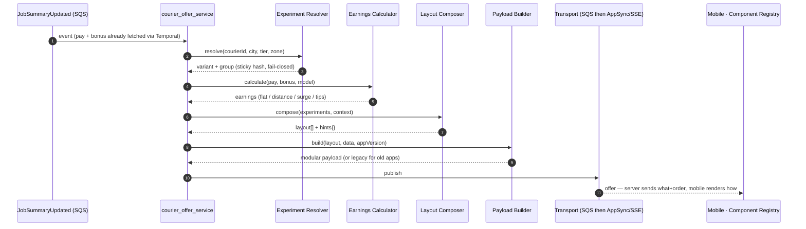

# End-to-End Design: Modular Offering System (Hybrid Approach)

## Context

The current courier offer system has a hardcoded `Offer.java` template (329 lines) that sends an identical JSON payload to all 50,000+ couriers across 15 countries. There's no way to A/B test presentations, personalize earnings displays, or roll out features gradually. The business needs experimentation, personalized earnings, gradual rollout, and multiple earning models — all within a 200ms p95 SLA at 2M offers/hour peak.

The hybrid approach (server-controlled layout + mobile native rendering) is recommended based on industry patterns (Uber, Lyft, Airbnb) and the fact that the current system already sends structured JSON data to mobile.

---

## Architecture Design

### New Components to Add

```
┌──────────────────────────────────────────────────────────────────┐
│  courier_offer_service (MODIFIED)                                │
│                                                                  │
│  Existing:                     New:                              │
│  ┌─────────────────┐          ┌──────────────────────────────┐  │
│  │ AbstractOffer    │          │ Experiment Resolver          │  │
│  │ Service          │─────────▶│ (assigns variant per courier)│  │
│  └─────────────────┘          └──────────────────────────────┘  │
│           │                              │                       │
│           │                    ┌──────────────────────────────┐  │
│           │                    │ Layout Composer              │  │
│           ├───────────────────▶│ (builds layout[] + hints)    │  │
│           │                    └──────────────────────────────┘  │
│           │                              │                       │
│           │                    ┌──────────────────────────────┐  │
│           │                    │ Earnings Calculator          │  │
│           ├───────────────────▶│ (unified: flat/distance/     │  │
│           │                    │  surge/tips prediction)      │  │
│           │                    └──────────────────────────────┘  │
│           │                              │                       │
│           ▼                              ▼                       │
│  ┌──────────────────────────────────────────────────────────┐   │
│  │ Offer Payload Builder (replaces hardcoded Offer.java)    │   │
│  │ - Builds modular payload based on layout + data          │   │
│  │ - Backward compatible: old format for old app versions   │   │
│  └──────────────────────────────────────────────────────────┘   │
│           │                                                      │
│           ▼ SendCourierMobileEvent (SQS)                         │
└──────────────────────────────────────────────────────────────────┘
```

### Component Details

#### 1. Experiment Resolver
- **Input:** courierId, city, courier tier, active shift zone
- **Output:** Map of active experiments with variant assignments
- **Implementation:** In-memory cache (Caffeine, 60s TTL) backed by a feature flag service (LaunchDarkly/Unleash or internal)
- **Latency budget:** ~3ms (cached lookup)
- **Segmentation:** by city, courier segment, percentage, courier tier
- **Stickiness:** assignment is deterministic — `hash(courierId + experimentId) % 100` compared to `treatment_pct`. Cache eviction does not flip a courier between variants because the hash is stable. Same courier → same variant for the lifetime of the experiment.
- **Failure mode:** if the flag service is unreachable, fall back to control for all experiments (fail-closed). Alert if fallback fires for >1% of requests.

#### 2. Layout Composer
- **Input:** experiment assignments, courier context (tier, location, time of day)
- **Output:** ordered list of component types + presentation hints
- **Implementation:** JSON layout configs stored in a config service or DB; loaded on service startup and refreshed every 30s in the background. Each instance keeps the last successfully-loaded copy in memory. If the source is unreachable on startup, the service falls back to a bundled default config and emits a critical alert.
- **Refresh model:** poll-based (not push) for simplicity. 30s convergence is acceptable because experiments roll forward, not toggle rapidly.
- **Latency budget:** ~2ms (in-memory lookup)
- **Example output:**
  ```json
  {
    "layout": ["offer_header", "earnings_breakdown", "distance_info", "accept_cta"],
    "hints": { "highlight": "surge", "urgency": "high" }
  }
  ```

#### 3. Earnings Calculator (Unified)
- **Consolidates:** Courier Pay + Courier Bonus + Promotions into one earnings view
- **Supports models:**
  - Flat rate: `{ "model": "flat", "total": 850 }`
  - Distance-based: `{ "model": "distance", "base": 400, "per_km": 120, "km": 3.2, "total": 784 }`
  - Surge pricing: `{ "model": "surge", "base": 450, "multiplier": 1.5, "surge_amount": 225, "total": 675 }`
  - Tips prediction: `{ "model": "tips_prediction", "base": 450, "predicted_tip_range": [80, 150], "total_range": [530, 600] }`
- **Data source:** Already available from Temporal workflow (CourierPay + CourierBonus responses)
- **Latency budget:** <10ms (computation only, data already fetched)

#### 4. Offer Payload Builder
- **Replaces:** `infrastructure/events/dto/out/Offer.java` → `Offer.fromDomain()`
- **Builds:** Modular payload based on layout + data
- **Backward compat:** Detects app version from courier context; old versions get legacy format. The exact source of "app version" (login token claim, courier-profile field, header carried through `SendCourierMobileEvent`, etc.) needs verification against the courier_offer_service code — see `handOver.md`. Until confirmed, assume a `clientVersion` field is added to courier context and populated upstream.
- **Unknown components on mobile:** mobile renders only components in its registry; unknown component names in `layout.components[]` are skipped silently (no empty space, no error toast). Mobile logs the skip for telemetry. This makes the server safe to add new components ahead of the app rollout.
- **For the full migration / mobile-rollout playbook** (when to use additive emission, version-gated emission, dual payload, layout fallbacks, and the change-type cheatsheet), see [`app-version-compatibility.md`](./app-version-compatibility.md).

### A/B Testing Scope (Confirmed)

A/B testing covers **two dimensions**, both varying by zone/country/courier segment:

| Dimension | What varies | Example |
|-----------|-------------|---------|
| **Data** | Different earnings models, units, fields | CH: flat rate in CHF/km; UK: distance-based in miles with tip prediction |
| **UI** | Different components, order, visual treatment | Zone A: simple total; Zone B: full earnings breakdown with surge indicator |

This means the Experiment Resolver + Layout Composer must support:
- **Per-zone/country layout configs** — different component lists per market
- **Per-zone/country data formatting** — units, currency, earnings model
- **Cross-cutting experiments** — A/B test within a single zone (e.g., 50% of London couriers see tip prediction)

Example — same delivery, three different markets:

```json
// Switzerland (flat rate, km, minimal UI)
{ "layout": ["earnings_total", "distance_summary", "stop_details", "accept_cta"],
  "data": { "earnings_total": { "total": 976, "currency": "CHF", "label": "Includes tip" },
            "distance_summary": { "value": 7.7, "unit": "km", "stops": 2 } } }

// UK (distance-based, miles, tip prediction)
{ "layout": ["earnings_breakdown", "tip_prediction", "distance_summary", "stop_details", "accept_cta"],
  "data": { "earnings_breakdown": { "model": "distance", "base": 350, "per_mile": 95, "miles": 4.8, "total": 806, "currency": "GBP" },
            "tip_prediction": { "range_min": 100, "range_max": 250, "confidence": "high" },
            "distance_summary": { "value": 4.8, "unit": "miles", "stops": 2 } } }

// Canada A/B test (50% see surge indicator)
{ "layout": ["earnings_breakdown", "surge_indicator", "distance_summary", "stop_details", "accept_cta"],
  "data": { "earnings_breakdown": { "model": "surge", "base": 650, "surge_amount": 200, "tip": 126, "total": 976, "currency": "CAD" },
            "surge_indicator": { "multiplier": 1.3, "zone": "Downtown Calgary" },
            "distance_summary": { "value": 7.7, "unit": "km", "stops": 2 } } }
```

---

### New Payload Contract

```json
{
  "version": 2,
  "offer_id": "uuid",
  "courier_id": "c123",
  "timestamp": 1714567890,
  
  "experiment": {
    "assignments": {
      "earnings_display": { "variant": "breakdown_v2", "group": "treatment" },
      "urgency_badge": { "variant": "enabled", "group": "treatment" }
    }
  },
  
  "layout": {
    "components": ["offer_header", "earnings_breakdown", "distance_summary", "surge_indicator", "accept_cta"],
    "hints": {
      "highlight_field": "surge",
      "theme": "urgent",
      "animation": "pulse_cta"
    }
  },
  
  "data": {
    "offer_header": {
      "restaurant_name": "Pizza Place",
      "offer_type": "STANDARD",
      "job_type": "DELIVER"
    },
    "earnings_breakdown": {
      "model": "surge",
      "base_pay": 450,
      "surge_amount": 120,
      "tip_estimate": 80,
      "bonuses": [{ "type": "peak_hour", "value": 50 }],
      "distance_allowance": 30,
      "total": 730,
      "currency": "CAD"
    },
    "distance_summary": {
      "distance_km": 3.2,
      "estimated_minutes": 12,
      "destination": {
        "address": "123 Main St",
        "city": "Toronto",
        "latitude": 43.65,
        "longitude": -79.38
      }
    },
    "surge_indicator": {
      "multiplier": 1.3,
      "zone": "Downtown",
      "nearby_couriers": 5,
      "expires_in_seconds": 30
    },
    "accept_cta": {
      "expiration_timestamp": 1714567920,
      "acceptance_rate": { "current": 85, "required": 80 }
    }
  },
  
  "jobs": { /* existing job data for backward compat */ },
  "deliveries": { /* existing delivery details */ }
}
```

### Current Offer UI (Screenshots)

Screenshots: `offer-screen-collapsed.png`, `offer-screen-expanded.png`

**Collapsed view (half-sheet):**
```
┌─────────────────────────────────────────────┐
│              [Map with route]                │
│   A (pickup) ──────────── B (delivery)      │
│                                             │
│          [ Navigate to business ]           │
├─────────────────────────────────────────────┤
│              $9.76                           │  ← earnings_total
│           Includes tip                      │
│         7.7 km · 2 stops                    │  ← distance_summary
├─────────────────────────────────────────────┤
│  🏠 1 pickup: Calgary The First             │  ← stop_details
│     11200 37 Street SW, Edmonton            │
│     [Arrive at 2:12 PM]                     │
│                                             │
│  👤 1 delivery: DataTest                    │
│     2631 17 Ave SW, Calgary                 │
│     [Arrive at 2:16 PM]                     │
├─────────────────────────────────────────────┤
│  [ Accept offer ]                    0:40   │  ← accept_cta
└─────────────────────────────────────────────┘
```

**Expanded view (full-sheet):**
```
┌─────────────────────────────────────────────┐
│              $9.76                           │  ← earnings_total
│           Includes tip                      │
│         7.7 km · 2 stops                    │  ← distance_summary
├─────────────────────────────────────────────┤
│  🏠 1 pickup: Calgary The First             │  ← stop_details
│     11200 37 Street SW, Edmonton            │
│     [Arrive at 2:12 PM]                     │
│                                             │
│  👤 1 delivery: DataTest                    │
│     2631 17 Ave SW, Calgary                 │
│     [Arrive at 2:16 PM]                     │
├─────────────────────────────────────────────┤
│          [ Navigate to business ]           │  ← navigation_cta
├─────────────────────────────────────────────┤
│  👤 Note from DataTest                      │  ← customer_note
│     Hello!                                  │
├─────────────────────────────────────────────┤
│  Order #100373735                           │  ← earnings_breakdown
│  Transit pay + stated tip        $9.76      │
│  Total earnings                  $9.76      │
├─────────────────────────────────────────────┤
│  Your acceptance rate: 50%         ⓘ       │  ← acceptance_rate
│  [████████████░░░░░░░░░░░] 80%              │
├─────────────────────────────────────────────┤
│  [ Accept offer ]                    0:35   │  ← accept_cta
└─────────────────────────────────────────────┘
```

### Component Registry (Mobile)

**Canonical name list** (this section is the source of truth — other documents must match):

`route_map`, `offer_header`, `earnings_total`, `earnings_breakdown`, `distance_summary`, `stop_details`, `navigation_cta`, `customer_note`, `acceptance_rate`, `accept_cta`, `decline_button`, `surge_indicator`, `tip_prediction`, `pooling_info`, `alcohol_warning`, `proof_of_delivery`.

Older drafts used `distance_info` and `urgency_badge` — those are dropped (use `distance_summary` and `surge_indicator` respectively).

Based on the actual app UI, here's the component registry mapped to real screens:

| Component | Current UI Element | Data Fields |
|-----------|-------------------|-------------|
| `route_map` | Map with A→B pins and route line | pickup coords, delivery coords, courier position |
| `earnings_total` | "$9.76 / Includes tip" | total amount, includes_tip flag, currency |
| `distance_summary` | "7.7 km · 2 stops" | distance_km, stop_count |
| `stop_details` | Pickup/delivery addresses with ETA | stops[] (type, name, address, arrive_at) |
| `navigation_cta` | "Navigate to business" button | destination coords, label |
| `customer_note` | "Note from DataTest: Hello!" | customer_name, note_text |
| `earnings_breakdown` | "Transit pay + stated tip $9.76 / Total earnings $9.76" | order_number, line_items[] (label, amount), total |
| `acceptance_rate` | "Your acceptance rate: 50%" with progress bar | current_rate, threshold (80%) |
| `accept_cta` | "Accept offer" button with countdown | countdown_seconds, expiration_timestamp |
| `decline_button` | "X Decline" top-left | — |
| `pooling_info` | (not shown, appears for MPP/ITP) | pool_type, stop_count, restaurants[] |
| `alcohol_warning` | (not shown, appears for alcohol orders) | — |
| `proof_of_delivery` | (not shown, appears when POD required) | pod_type, metadata |
| `tip_prediction` | (NEW — not in current app) | predicted_range, confidence |
| `surge_indicator` | (NEW — not in current app) | multiplier, surge_zone |

### A/B Test Opportunities (from current UI)

| Experiment | Control (current) | Treatment (proposed) |
|------------|-------------------|---------------------|
| Earnings display | "$9.76 / Includes tip" (single line) | Detailed breakdown: base $6.50 + tip $3.26 = $9.76 |
| Distance display | "7.7 km · 2 stops" | "12 min drive · 2 stops" (time-based) |
| Acceptance rate | Progress bar at bottom | Badge/pill near accept button |
| Tip visibility | "Includes tip" (no amount) | "Tip: $3.26" (explicit amount) |
| Urgency | Countdown timer only | "5 couriers nearby" + countdown |
| Earnings model | Flat total | Per-km breakdown: "$1.27/km × 7.7km" |

Unknown components → skipped (forward compat for old app versions).

---

## Implementation Details

### Where to Modify in courier_offer_service

#### Step 1: Add Experiment Resolver

New files:
- `domain/experiment/ExperimentResolver.java` — interface
- `domain/experiment/ExperimentAssignment.java` — record (experimentId, variant, group)
- `infrastructure/experiment/CachedExperimentResolver.java` — Caffeine-cached implementation
- `infrastructure/rest/clients/FeatureFlagClient.java` — REST client to flag service

Integration point: `AbstractOfferService.sendOfferWithPayBonus()` (line ~286) — resolve experiments after data is fetched, before offer creation.

#### Step 2: Add Layout Composer

New files:
- `domain/layout/LayoutComposer.java` — interface
- `domain/layout/LayoutConfig.java` — record (components list, hints map)
- `infrastructure/layout/ConfigDrivenLayoutComposer.java` — reads layout rules from config

Integration point: Called after experiment resolution, before payload building.

#### Step 3: Add Unified Earnings Calculator

New files:
- `domain/earnings/EarningsCalculator.java` — interface
- `domain/earnings/EarningsBreakdown.java` — record with model-specific fields
- `domain/earnings/models/` — FlatRateModel, DistanceModel, SurgeModel, TipsPredictionModel
- `infrastructure/earnings/UnifiedEarningsCalculator.java` — delegates to model based on config

Integration point: Replaces the raw `DeliveryPay` mapping in `AbstractOfferService.sendOfferWithPayBonus()` (lines 261-269).

#### Step 4: Replace Offer.java with Modular Payload Builder

New files:
- `domain/payload/ModularOfferPayload.java` — new payload structure
- `domain/payload/OfferPayloadBuilder.java` — builds modular payload from layout + data
- `infrastructure/events/dto/out/ModularOffer.java` — new DTO (coexists with Offer.java during migration)

Integration point: `EventPublishingService.serializeOffer()` — branch on app version:
- Old apps → `Offer.fromDomain()` (existing)
- New apps → `ModularOffer.fromComponents()` (new)

### Modified Flow (After Changes)

> 改造后的事件流：在同一条事件链上插入 4 个新组件（Experiment Resolver → Earnings Calculator → Layout Composer → Payload Builder），输出按 app 版本分支。**server 决定 what + order，mobile 决定 how。**
>
> 端上运行时视角（app 冷启动如何拿 layout、offer 怎么渲染、模板更新怎么传播）见 [`runtime-dataflow.md`](../zh/runtime-dataflow.md)。



```
AbstractOfferService.sendOfferWithPayBonus():
    │
    ├── [existing] Fetch deliveryPay, bonuses, offerItems, POD, merchantIds
    │
    ├── [NEW] ExperimentResolver.resolve(courierId, city, tier, zone)
    │         → Map<String, ExperimentAssignment>
    │
    ├── [NEW] EarningsCalculator.calculate(deliveryPay, bonuses, earningsModel)
    │         → EarningsBreakdown (model-specific)
    │
    ├── [NEW] LayoutComposer.compose(experiments, courierContext)
    │         → LayoutConfig (components[], hints{})
    │
    ├── [NEW] OfferPayloadBuilder.build(layout, earnings, offerItems, jobDetails, experiments)
    │         → ModularOfferPayload
    │
    └── [modified] saveAndSendOffer()
            → Serialize ModularOfferPayload (or legacy Offer for old apps)
            → Publish SendCourierMobileEvent
```

---

## Offer Delivery Resilience (push channel failure)

> 高概率追问："如果 SSE / async 推送（AppSync WebSocket）挂了怎么办？" offer 是**时效性**的（~40s 倒计时），所以投递可靠性是业务关键。

### Core principle: push is a latency optimization, not the source of truth

The WebSocket/SSE push only makes the offer arrive *faster*. The **source of truth is the server-side offer/assignment state**, which is queryable. When push fails, the client falls back to **pull-and-reconcile**. Every mitigation below derives from this principle.

### Failure modes & mitigations

| Failure mode | Mitigation |
|---|---|
| **Client disconnect** (network blip, app backgrounded, socket drop — most common) | Auto-reconnect (SSE built-in; demo sets `retry: 3000`). **On reconnect, pull `GET /offers/active` to reconcile** any missed offers. |
| **Lost delivery** (pushed but not received/ACKed) | Offers carry `offer_id`; client **dedups** (push and pull may both deliver the same offer → render once). Delivery is **idempotent**. |
| **Zombie connection** (TCP alive, messages not flowing) | **Heartbeat ping** (demo sends `: ping` every 15s); missed pings → reconnect. |
| **Server pipeline failure** (SQS backlog, mobile-async down, AppSync outage) | SQS **durably buffers**; consumers redeliver on recovery — but **TTL-aware**: drop offers past their validity window instead of delivering a stale offer. |
| **No live connection for the courier** | Server is **connection-aware** (demo: dispatch returns `delivered` / `eventBus.count()`). No connection → wake the app via **push notification (APNs/FCM)**, which then pulls the current offer. |

### The business-level safety net (why a lost push never loses the order)

Two server-side guarantees matter more than any transport trick:

1. **Expiry → re-offer.** If the courier doesn't ACK acceptance within the ~40s window (never received it, or received it late), the **assignment system (Skynet/HAL) re-offers the delivery to the next courier.** A failed push degrades to *"this courier missed it, the next one gets it"* — **the order is not lost, assignment is just slightly slower.** This is the root reason the system can tolerate an unreliable push channel.

2. **Atomic claim → no double-assignment.** Retries + re-offer can deliver the *same* delivery to multiple couriers. Acceptance is therefore a server-side **compare-and-set claim on the delivery state: first ACK wins, late ACKs are rejected** ("offer no longer available"). Even with duplicate delivery, only one courier can claim it.

> Together these cover both **availability** (no lost order) and **correctness** (no double-assignment) — the two sides of a distributed delivery channel.

### What the demo already implements

- SSE auto-reconnect + `retry: 3000` + 15s heartbeat ping (`server/routes/stream.js`)
- The pull path `GET /api/offer/:tenant` is retained as the **reconcile entry point**
- Connection-aware dispatch: `/api/dispatch` returns `delivered` + `eventBus.count()`
- Client shows live connection status (connecting / connected / reconnecting); a disconnected stream never presents a stale offer as actionable

### One-line framing

> *"I treat push as a latency optimization, not the source of truth. The client reconciles by pulling on reconnect, dedups by `offer_id`, and detects liveness via heartbeat; the server buffers in SQS but redelivers TTL-aware. What actually prevents lost orders is the business layer: an unaccepted offer expires and **re-offers to the next courier**, and acceptance is an **atomic server-side claim — first ACK wins**. Worst case is slightly slower assignment, never a lost or double-assigned delivery."*

---

## Migration Strategy

### Phase 1: Foundation (Weeks 1-3)
- Add ExperimentResolver with no-op implementation (always returns control group)
- Add EarningsCalculator that wraps existing pay/bonus logic (same output, new interface)
- Add LayoutComposer returning default layout (matches current Offer.java structure)
- **No behavior change** — verify with shadow mode comparison

### Phase 2: Dual Payload (Weeks 4-6)
- Build ModularOffer DTO alongside existing Offer.java
- EventPublishingService sends BOTH formats:
  - `data` field: legacy JSON (existing behavior)
  - `data_v2` field: modular payload (new format)
- Mobile team begins implementing component registry using `data_v2`
- **Metric:** Compare `data` vs `data_v2` for field parity

### Phase 3: Feature Flag Rollout (Weeks 7-10)
- Mobile app ships with component registry + fallback to legacy rendering
- Wire the **real experiment service** here (LaunchDarkly / internal flag service) — needed for the rollout flag itself, so it can't wait until Phase 4
- Flip couriers to `data_v2` via feature flag:
  - 1% → 5% → 25% → 50% → 100% (per city)
  - Monitor: acceptance rate, render time, crash rate
- The "first experiment" in this phase (`data_v2` on/off) doubles as the smoke test for the experiment service itself

### Phase 4: Experimentation Live (Weeks 11-14)
- Run first *content* A/B test on earnings presentation (separate experiment from the rollout flag)
- Add surge pricing model + tips prediction model
- Gradually remove legacy Offer.java path as old app versions sunset

### Rollback Plan
- Feature flag instant-off: revert any courier to legacy payload
- Dual-write means mobile can always fall back to `data` field
- No data loss — legacy path remains functional throughout

---

## Metrics to Track

| Category | Metric | Target |
|----------|--------|--------|
| **SLA** | p95 offer delivery latency | ≤200ms (currently 180ms) |
| **SLA** | p99 offer delivery latency | ≤300ms |
| **Reliability** | Offer delivery failure rate | <0.1% |
| **Business** | Offer acceptance rate (per variant) | No regression from baseline |
| **Business** | Time-to-accept | No regression |
| **Business** | Earnings dispute rate | No increase |
| **Experiment** | Experiment assignment consistency | 100% (same courier = same variant — enforced by deterministic hash of `courierId + experimentId`) |
| **Experiment** | Flag-service fallback rate | <1% (alerts above this) |
| **Experiment** | Time from experiment idea to live | <1 week (target) |
| **Mobile** | Offer card render time | <50ms |
| **Mobile** | Crash rate on offer screen | No increase |
| **Migration** | % offers on v2 payload | Track rollout progress |
| **Migration** | Legacy vs modular payload field parity | 100% during dual-write |

---

## Latency Budget (200ms total)

Current p95 is ~180ms (subject to verification — see `handOver.md`). The SLA is 200ms. That leaves ~20ms of *real* headroom — and new on-path work must come out of that 20ms, not in addition to it.

| Step | Today | Hybrid | Δ |
|------|-------|--------|---|
| Temporal workflow (pay + bonus) | ~150ms | ~150ms | 0 |
| Existing offer assembly + SQS publish | ~30ms | ~30ms | 0 |
| Experiment resolution | — | ~3ms | +3ms |
| Earnings calculator (unified) | — (folded into existing mapping) | ~3ms | +3ms |
| Layout composition | — | ~2ms | +2ms |
| Modular payload build + serialize | — (replaces current Offer serialize) | ~5ms | +2ms vs current ~3ms |
| **Total p95** | **~180ms** | **~190ms** | **+10ms** |
| **SLA buffer remaining** | 20ms | ~10ms | — |

The numbers above are targets, not measurements. Before Phase 3 rollout, run a load test that measures the *actual* added latency on a real cluster. If the measured Δ exceeds 15ms, either reclaim time from the 30ms existing-assembly path, push experiment/layout resolution off the request path (precompute per courier), or revisit the SLA with the business.

### Where the 180ms goes — and how to create headroom

We're inside the 200ms SLA, so this is about **headroom + tail latency + future features**, not a fire. But if asked "how would you make it faster?":

**Attack the right thing.** The **Temporal workflow (pay + bonus) is ~150ms ≈ 83%** of the budget; the existing assembly + SQS is ~30ms; the four new hybrid components are ~10ms — a **rounding error**. Optimizing the new components moves nothing; the leverage is the 150ms.

**Biggest wins (the 150ms):**
- **Parallelize** pay / bonus / promotions — they're largely independent but likely run sequentially today. Fan them out → save the smaller of the two.
- **Cache / precompute slow-changing inputs** — pricing rates, courier tier, surge multipliers change slowly. Precompute per zone/courier into Redis/Caffeine so the workflow reads cache instead of synchronously calling Data Science — and skips the **1.5s pricing-signal wait** (a major p99 driver).
- **Speculative precompute** — compute pay+bonus while assignment is still considering the courier, so at offer time it's a cache read.

**Smaller wins:**
- Leaner payload + compiled serialization (the legacy `Offer.java` is 329 lines / 22+ fields).
- Move experiment/layout resolution **off the request path** (they're sticky/slow-changing → precompute per courier, read from cache).
- Connection pooling / reuse to cut connection setup.

**Tail (p99) reduction:** warm caches, **fail-fast timeouts with fallback values** (don't block on a slow dependency), eliminate synchronous I/O on the path.

**Architectural win (SDUI enables it):** decouple "show the offer" from "compute the exact pay." Render the offer card immediately with a **cached/estimated earnings**, then **refine the precise number via the live stream** (SSE/AppSync) a beat later. Perceived latency drops sharply — and only the hybrid model lets mobile re-render when the exact data arrives.

> Staff framing: *measure where the 150ms actually goes (pricing wait vs pay vs bonus) before optimizing; don't touch the 10ms; we're within SLA so this buys headroom and shrinks the tail.*

---

## Verification Plan

1. **Unit tests:** Each new component (ExperimentResolver, LayoutComposer, EarningsCalculator, PayloadBuilder)
2. **Integration test:** Full flow from JobSummaryUpdated → ModularOffer payload verification
3. **Shadow mode:** Run new path in parallel with existing, compare outputs
4. **Load test:** Verify 200ms SLA at 2M/hour with new components added
5. **Canary:** 1 city (small market) before global rollout
