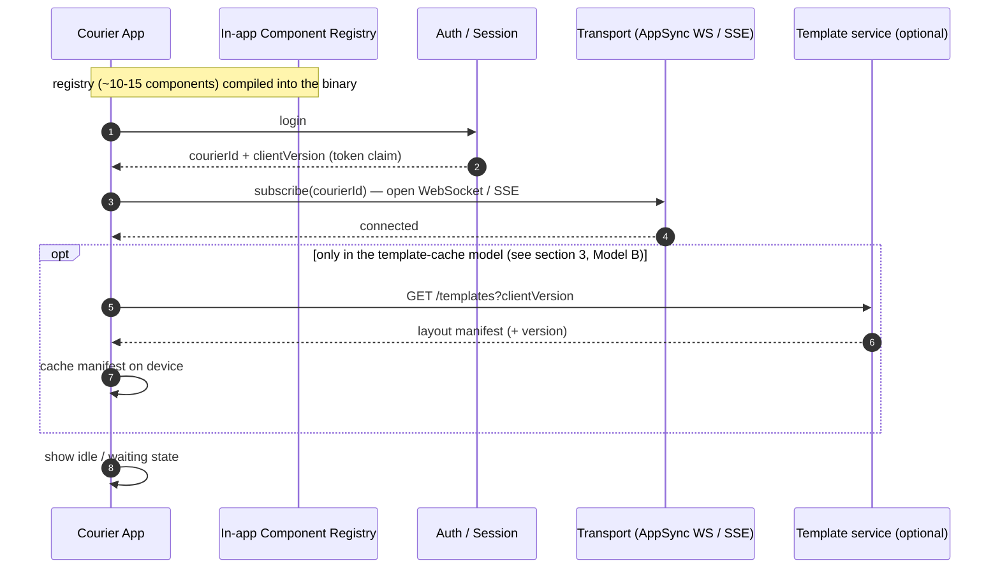
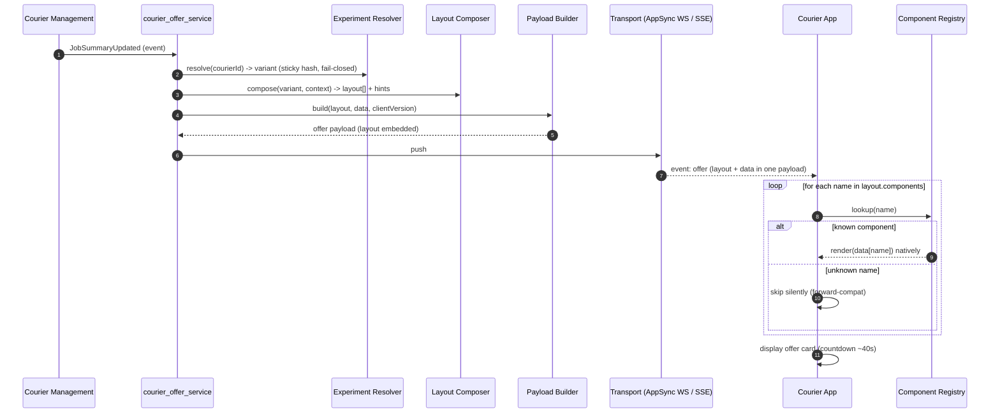
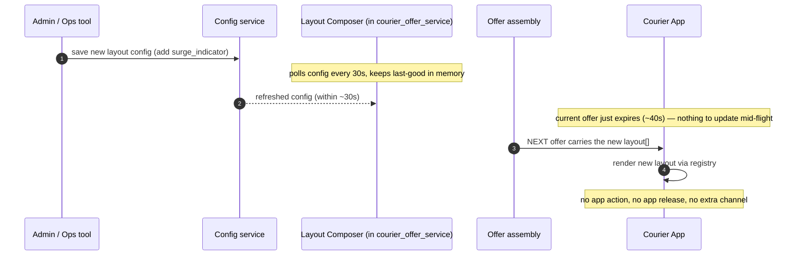
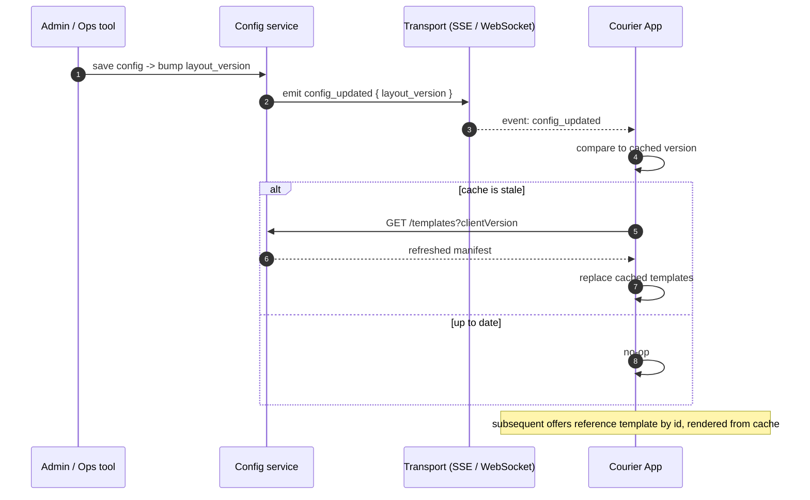

# Runtime Data Flow (Approach C) — App Cold Start, Offer Delivery, Template Updates

> Client-side perspective on runtime data flow: how the app gets a layout at cold start, how an offer is pushed down and rendered, and **how layout/template updates propagate**.
> The corresponding server-side event flow is in [`courier-offer-system-architecture.md`](./courier-offer-system-architecture.md) and the Mermaid sequence diagrams in [`hybrid-end-to-end-design.md`](./hybrid-end-to-end-design.md).
> Chinese version: [`../study-notes/runtime-dataflow.md`](../study-notes/runtime-dataflow.md)

---

## A key design decision to remember first

In Approach C, **three things** can change, and they each propagate completely differently — once you separate them, the whole picture becomes clear:

| What can change | Where it lives | How it propagates | App release needed? |
|-----------------|----------------|-------------------|---------------------|
| **Component Registry** (the actual render code, ~10–15 components) | **Inside the app binary** (compiled in) | Ships with an app release | ✅ Yes |
| **Layout descriptor** (which components, order, hints) | **Server-side Layout Composer** | **Embedded inside each offer's payload** | ❌ No |
| **Offer data** (earnings, distance, address…) | Server, computed per offer in real time | Also pushed in the offer payload | ❌ No |

> 🔑 **The key insight**: the app **does not separately "fetch the template"**. The layout is **baked into every offer**. So "template update" = "the next offer arrives with the new layout" — **no extra channel needed by default**.
>
> This is especially true for the courier delivery scenario, because **offers are short-lived (~40s before they expire)**. You don't need to push a template update to a screen that's about to disappear — the next offer naturally carries the new layout.

---

## ① App cold start (initial state)

When the app starts, it **does NOT fetch a server template** — the registry is already compiled into the binary. It just needs to: log in to get `courierId` → open the push connection → wait for offers.

**Key points:**
- In the baseline model, cold start has **no** `GET /templates` step (the `opt` block appears only in the optional caching model).
- What the screen shows *before* the first offer arrives is **the app's built-in static UI** (skeleton / "waiting for dispatch"), not a server template.
- `clientVersion` (used for old-app compatibility / version negotiation) comes from the login token claim — exact source to be verified against the real codebase, see `handOver.md`.

---

## ② Offer delivery (steady state — layout is shipped in the payload)

Each offer carries its own `layout[]`. The app just **iterates → registry lookup → native render** — no "what should I display" logic at all.

**Key points:**
- Layout and data arrive in the **same payload** — the app needs no second request.
- **Unknown components are skipped silently** = old apps don't crash on new components, and the server can ship ahead of the app.
- This is exactly what the demo does today (`/api/dispatch` push → `/api/stream` SSE → `OfferRenderer` iterates `layout.components`).

---

## ③ Layout / template updates — how do they propagate? (Two models)

### Model A — Baseline: don't push the template, just let the next offer carry it ✅ Recommended

Operations changes a layout config (e.g. add `surge_indicator` to a zone) in admin:

- **Convergence time**: ≤ 30s (config polling) + the time to the next offer. **More than enough** for the courier scenario.
- **Why this is the best default**: offers are short-lived; there's no need to "refresh a screen that's already up" — the next offer carries the new layout naturally. Simplest, least failure-prone.
- ⚠️ Precondition: the components referenced by the new layout **must already be in the app's registry**. If the layout references a component the app doesn't yet have → that component is skipped silently until the next app release (see [`app-version-compatibility.md`](./app-version-compatibility.md)).

### Model B — Optional optimization: cache templates on the device + push invalidation via SSE

You only need this when **(a) the payload grows because the same layout repeats**, or **(b) you want many offers to share the same template**. The cost is extra cache-invalidation logic.

- Here **SSE/WebSocket carries not only offers but also `config_updated` control events** — this is the "what happens when the template updates" question made concrete.
- The offer payload shrinks (just carries `template_id` + data, not the full layout), but it introduces **cache-consistency issues** (version comparison, invalidation, fallback).

### How to choose between the two models

| | Model A (baseline) | Model B (cache + push invalidation) |
|---|---|---|
| Where is the layout | Embedded in every offer | Cached on device; offer carries only template_id |
| Update propagation | Travels with the next offer | `config_updated` SSE event → re-fetch |
| Complexity | Low | High (cache invalidation) |
| Payload size | Slightly larger (repeated layout) | Smaller |
| Best for | **Short-lived offers (the courier scenario) ✅** | Long-lived screens / heavily shared templates |

> **Interview takeaway**: default to **Model A** — "offers are short-lived, so embedding the layout per-offer is simplest and doesn't even need a template sync channel. I'd only graduate to Model B (device cache + SSE push invalidation) when the payload size or template reuse genuinely becomes the problem." This judgment — knowing **when NOT to add complexity** — is itself a Staff signal.

---

## ③.5 Deep dive: cost & caching trade-offs of "ship layout in every offer"

> This is the most likely on-the-spot follow-up: *"Doesn't shipping the layout in every offer add cost? Could you use a layout-version so the client can reuse it?"* Here's the full reasoning.

### First, split "cost" into two kinds — don't conflate them

| Cost | Reality |
|------|---------|
| **Compute cost** (recomputing the layout for every offer) | Essentially zero, and can be eliminated entirely |
| **Bandwidth / payload cost** (repeating the layout in every offer) | Real, but tiny at this scale |

**Compute cost ≈ 0 — because the layout doesn't depend on the individual courier.**
The layout only depends on `(variant, zone, tier)`, not on a specific courier's data. The layout for "CA + treatment" is identical across all CA-treatment couriers → the server **memoizes by `(variant, zone, tier)`**, computes it once, reuses it across all offers → **per-offer compute cost ≈ 0**. The Layout Composer is an in-memory lookup anyway (~2ms, already inside the latency budget); it doesn't call any external service.

**Bandwidth cost — quantify it and you'll see it doesn't hurt:**
- `layout[]` ≈ 8 component names ≈ ~150 bytes; the `data` block is several KB → the layout is a rounding error.
- ~30–100 offers/day per courier × 150B ≈ ~15KB/day/courier.
- 50,000 couriers ≈ ~750MB/day of layout bytes total → negligible to the backend.

> So the default is **embed it** (Model A): compute memoizes to ≈ 0, bandwidth is a rounding error.

### layout-version + reuse = Model B — the right idea, but it has a fatal weakness

The offer only carries `layout_version`; the client looks it up locally by version — this is the standard **version-by-reference + on-device cache** pattern (analogous to HTTP ETag or content addressing). But its weakness is **cache miss**:

⚠️ If an offer references a `layout_version` **the client doesn't have** (server just rolled out a new layout the client hasn't fetched / fresh install / missed the push) → the client can't find it → **the whole screen fails to render → BREAK**.

🔴 **Severity escalation:**
- "Unknown **component** silently skipped" = **local** failure (one component missing, rest still render).
- "Unknown **layout_version**" = **whole-screen** failure (the offer has no idea what to render).
- **Model B turns a "locally degradable" failure into a "whole-screen" failure — that's its biggest cost.**

### If you really want Model B, how to prevent breaking (4 mechanisms, none optional)

| # | Mechanism | What it does |
|---|------|------|
| ① | **Immutable + versioned layouts** (version = content hash) | Same name always means same content — eliminates "same version, different content" |
| ② | **push-before-use** | Server pushes the `config_updated` SSE event *before* it starts referencing the new version, so the client pre-fetches; it only references versions the client already has |
| ③ | **fetch-on-miss (last-resort fetch)** | On cache miss, synchronously `GET /templates/{version}` before rendering |
| ④ | 🔴 **Built-in default layout (the most critical, fail-soft)** | The app binary always carries a default layout; if it gets an unknown version *and* can't fetch it → render with the default. The offer's `data` is still there, so earnings/distance/Accept still display |

**④ is the actual safety net**: an offer has ~40s on its countdown, so an extra network round-trip on cache miss is bad (worse if the device is offline). So **a layout fetch must never block the offer** — if it can't be fetched, fall back immediately to the built-in default. **Worst case: the courier sees the default style (no experiment optimization), but they can still accept the offer — never a blank screen, never a lost dispatch.**

### One-line summary (interview-ready)

> *"I'd default to embedding the layout in the payload. At this scale it's essentially free — compute memoizes to nearly zero per `(variant, zone, tier)`, and bandwidth is a rounding error — and it eliminates an entire class of cache-miss failures. Version-by-reference + on-device cache is a real optimization, but it turns 'a single missing component' into 'a whole blank screen.' Unless I measure real bandwidth pain, I won't trade robustness for those bytes. If I do take that path, I'd build the full safety net: immutable versions + push-before-use + fetch-on-miss + a built-in default layout that always renders something useful."*

This judgment — **knowing the optimization exists, and knowing when *not* to use it** — is the Staff signal. Same instinct as "Is Flink overkill for our event rate?"

---

## ④ What changes, how it propagates, and whether you need a release (cheat sheet)

| Change | Propagation | Release? |
|--------|-------------|----------|
| Reorder / show-hide / swap an **existing** component | Layout Composer config → next offer's `layout[]` | ❌ No |
| Hints (highlight, theme) | Same as above | ❌ No |
| Experiment assignment / rollout percentage | Experiment Resolver config → next offer | ❌ No |
| **Add** an optional field to an existing component | Additive, old apps ignore | ❌ No (additive is safe) |
| **New component type** | Must be in the app's registry first | ✅ Yes |
| Change the data **semantics** of an existing component | Ship as a new component (v2) or dual-emit | ✅ Yes (or transition via dual-emit) |

Full release / compatibility playbook in [`app-version-compatibility.md`](./app-version-compatibility.md).

---

## Related

- [`courier-offer-system-architecture.md`](./courier-offer-system-architecture.md) — current backend event flow (Mermaid)
- [`hybrid-end-to-end-design.md`](./hybrid-end-to-end-design.md) — post-migration flow + payload contract
- [`app-version-compatibility.md`](./app-version-compatibility.md) — old-app compatibility and version negotiation
- [`../demo/`](../demo/) — runnable implementation (Model A: SSE push, layout embedded)
