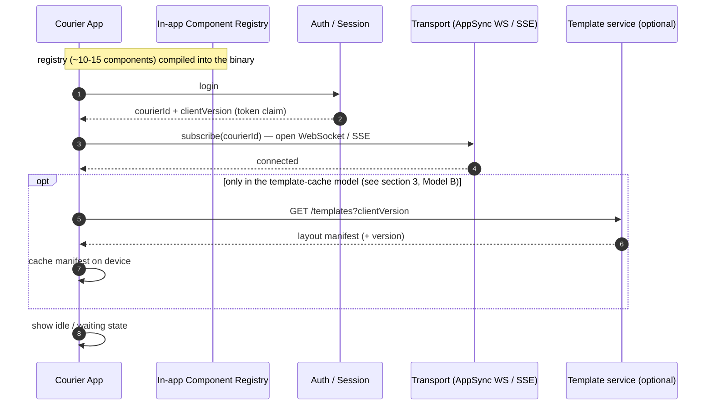
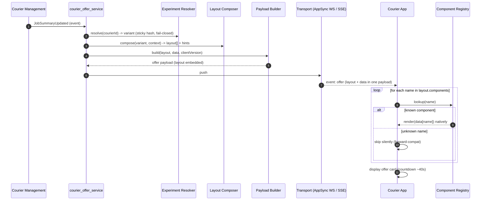
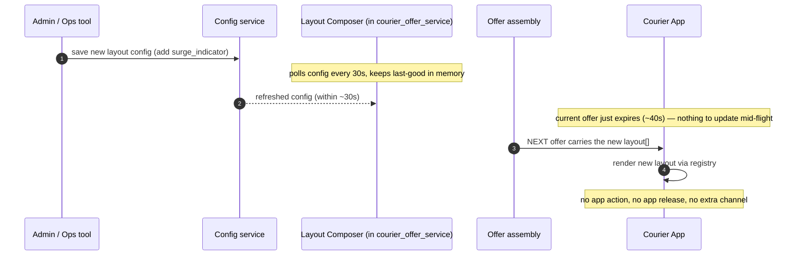
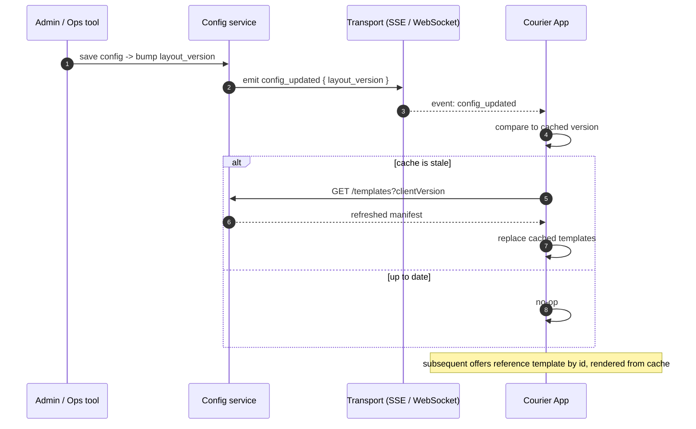

# Runtime Data Flow (Approach C) — App Cold Start, Offer Delivery, Template Updates

> 端上视角的运行时数据流：app 冷启动如何拿到 layout、一个 offer 怎么被推下来渲染、以及 **layout/模板更新了怎么传播**。
> 配套后端事件流见 `courier-offer-system-architecture.md` 与 `hybrid-end-to-end-design.md` 里的 Mermaid 时序图。

---

## 先记住一个关键设计决定

方案 C 里有**三样东西**会"变"，它们的传播方式完全不同——分清楚这三样，整张图就清楚了：

| 会变的东西 | 住在哪 | 怎么传播 | 要发版吗 |
|-----------|--------|----------|---------|
| **Component Registry**（组件的实际渲染代码，~10–15 个） | **App 二进制内**（编译进去） | 随 app 发布 | ✅ 要 |
| **Layout 描述符**（哪些组件、顺序、hints） | **服务端 Layout Composer** | 在**每个 offer 的 payload 里随包带下来** | ❌ 不要 |
| **Offer 数据**（earnings、距离、地址…） | 服务端，每单实时算 | 同样随 offer payload 推下来 | ❌ 不要 |

> 🔑 **核心**：app **不单独"去读模板"**。layout 是**烤进每个 offer**的。所以"模板更新"= "下一个 offer 自带新 layout"，**默认零额外通道**。
>
> 这一点在快递场景特别成立，因为 **offer 是短命的**（~40 秒就过期）——你根本不需要把模板更新推给一个马上要消失的屏幕，下一单自然带新 layout。

---

## ① App 冷启动（initial state）

app 启动时**不读服务端模板**——registry 已经编译在二进制里，它只需：登录拿 `courierId` → 开推送连接 → 等 offer。

**要点**：
- 基线模型里，冷启动**没有** `GET /templates` 这一步（那个 `opt` 框只在可选的缓存模型里出现）。
- app 在拿到第一个 offer **之前**屏幕上显示什么，是**app 内置的静态 UI**（如 skeleton / "等待派单"），不是服务端模板。
- `clientVersion`（用于老 app 兼容/版本协商）从登录 token claim 拿——具体来源待向真实代码核实，见 `handOver.md`。

---

## ② Offer 投递（steady state，layout 随包带下来）

每个 offer 自带 `layout[]`。app 只是**遍历 → registry 查表 → 原生渲染**，没有任何"该显示什么"的判断逻辑。

**要点**：
- layout 和 data 在**同一个 payload** 里到达——app 不需要二次请求。
- **未知组件静默跳过** = 老 app 遇到新组件不崩、server 可以领先 app 发布。
- 这就是 demo 现在的行为（`/api/dispatch` 推 → `/api/stream` SSE → `OfferRenderer` 遍历 `layout.components`）。

---

## ③ Layout / 模板更新了，怎么传播？（两种模型）

### Model A —— 基线：不推模板，layout 跟着下一个 offer 走 ✅ 推荐

运营在 admin 改了 layout config（比如给某 zone 加 `surge_indicator`）后：

- **收敛时间**：≤ 30s（config 轮询）+ 到下一个 offer。对快递场景**完全够**。
- **为什么这样最好**：offer 短命，没有"改了模板要刷新正在看的屏幕"的需求——下一单自带新 layout。最简单、最少出错。
- ⚠️ 前提：新 layout 引用的组件**必须已在 app registry 里**。若引用了 app 还没有的新组件 → 该组件被静默跳过，直到 app 发版（见 `app-version-compatibility.md`）。

### Model B —— 可选优化：端上缓存模板 + SSE 推送失效

只有当 **(a) payload 因为重复 layout 变大**，或 **(b) 你想让很多 offer 共享同一份模板** 时才需要。代价是多一套缓存失效逻辑。

- 这里 **SSE/WebSocket 不只推 offer，也推 `config_updated` 控制事件**——这正是你问的"TemplateUpdate 了会怎样"。
- offer payload 变小（只带 `template_id` + data，不带完整 layout），但引入**缓存一致性**问题（版本比对、失效、回退）。

### 两个模型怎么选

| | Model A（基线） | Model B（缓存+推送失效） |
|---|---|---|
| layout 在哪 | 每个 offer 内嵌 | 端上缓存，offer 只带 template_id |
| 更新传播 | 跟下一个 offer | `config_updated` SSE 事件 → 重新拉 |
| 复杂度 | 低 | 高（缓存失效） |
| payload 大小 | 略大（重复 layout） | 小 |
| 适合 | **短命 offer（快递场景）✅** | 长驻屏幕 / 海量共享模板 |

> **面试结论**：默认用 **Model A**——"offer 短命，layout 随包带最简单，连模板同步通道都不需要。只有当 payload 体积或模板复用成为问题时，我才会升级到 Model B 那种端上缓存 + SSE 推送失效的方案。" 这个"知道何时**不**加复杂度"的判断本身就是 Staff 信号。

---

## ④ 什么会变、怎么传、要不要发版（速查）

| 变化 | 传播方式 | 发版？ |
|------|----------|--------|
| 重排 / 显隐 / 替换**已有**组件 | Layout Composer config → 下个 offer 的 `layout[]` | ❌ 否 |
| hints（highlight、theme） | 同上 | ❌ 否 |
| 实验分配 / 灰度百分比 | Experiment Resolver config → 下个 offer | ❌ 否 |
| 给已有组件**加**一个可选字段 | additive，老 app 忽略 | ❌ 否（加法安全） |
| **新组件类型** | 必须先进 app 内 registry | ✅ 是 |
| 改已有组件的数据**语义** | 当新组件（v2）或双发 | ✅ 是（或双发过渡） |

详细的发版/兼容 playbook 见 [`app-version-compatibility.md`](./app-version-compatibility.md)。

---

## Related

- `courier-offer-system-architecture.md` — 现状后端事件流（Mermaid）
- `hybrid-end-to-end-design.md` — 改造后流程 + payload 契约
- `app-version-compatibility.md` — 老 app 兼容与版本协商
- `demo/` — 可运行实现（Model A：SSE 推 offer，layout 内嵌）
