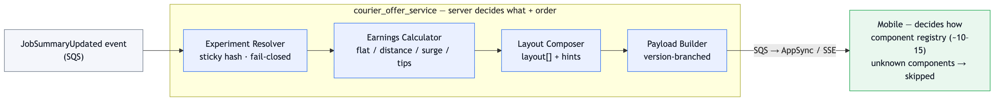
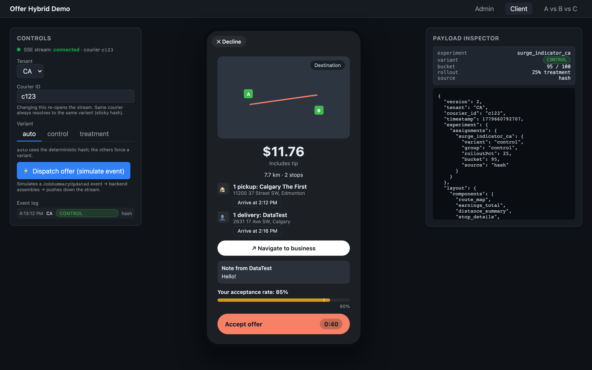

<!-- _class: lead -->
<!-- _paginate: false -->

# Courier Offer System Modernization
## & Real-time Fraud Detection Team Guidance

**Tony (Qihuan Yang)**

<!--
开场定调（30秒念这段）：
- 今天约 32 分钟讲 UC1、22 分钟 UC2，留几分钟 Q&A。
- 我对 Staff 的理解：通过【影响力而非权威】驱动决策，【动手做 POC、快速试错】。
- 两个 case 都按这个标准答。我还做了一个可运行的原型来验证 UC1 的方案。
-->

---

## Agenda

**Use Case 1 — Courier Offering System** (~30 min)
1. Technical Decision — evaluate Approach A vs B, then recommend
2. System Design — end-to-end architecture
3. Technical Leadership — facilitating the mobile team
4. Migration Strategy — metrics & rollback

**Use Case 2 — Fraud Detection Team Guidance** (~20 min)
Diagnose · Guide without solving · 3-day plan · Knowledge transfer · Work with TM

*Questions welcome throughout — let's make it a conversation.*

<!--
一句话主线：UC1 证明我能做架构和技术判断；UC2 证明我能放大团队、而不是替团队干活。
让面试官知道我会管理时间——这本身就是 Staff 信号。
-->

---

# Use Case 1

## Courier Offering System Modernization

<!-- _class: lead -->

---

## Problem & Constraints

- 15 countries · 50,000+ couriers · **2M offers/hour** peak (~556 RPS)
- SLA **200 ms p95** — today ~180 ms → only **~20 ms real headroom**
- Needs: A/B presentation · personalized earnings · gradual rollout · multiple earning models

**Today:** one hardcoded `Offer.java`, earnings logic across 3 services, every change = full multi-region deploy, **no A/B testing**

> Already an **event-driven, distributed** system (SQS + Temporal + AppSync on AWS), already pushing structured JSON to mobile → my answer is **evolution, not rewrite**.

<!--
钉住约束，尤其 20ms headroom——后面所有设计都活在这 20ms 里。
痛点是"僵化"，不是性能：改不动、试不动。
最后一句是推荐 C 的伏笔，也撞 JD 的 event-driven / distributed systems。
-->

---

## Technical Decision — A vs B (the two options on the table)

| | A (Template DSL) | B (Raw data + mobile) |
|---|---|---|
| Experiment speed | fast (server-only) | **slow** (app release per change) |
| 200 ms risk @ 2M/h | **high** (server renders) | low |
| Native UX | **poor** | great |
| iOS/Android consistency | guaranteed | **hard** |
| Mobile complexity | lowest | **highest** |

**Neither alone wins:** A buys experiment speed but gives up native UX *and* risks the 200 ms SLA; B keeps native UX but every layout experiment needs an app release.

<!--
先只摆题目给的两个 A/B，凸显各自硬伤——A 牺牲 UX+延迟，B 牺牲实验速度+一致性。
别急着给答案，这页是为下一页"引出 C"铺垫。
-->

---

## Approach C (Hybrid) — take the best of both ✅

> The prompt framed it as A **or** B. The real answer **combines** them.

- **From A:** server controls *what + order* → experiment **without an app release**
- **From B:** mobile renders **natively** → great UX, uses the platform
- **One line:** *server decides what + order; mobile decides how* (component registry)

**B vs C — the one real difference:** "which components & in what order" is **app logic on mobile in B**, but **data from the server in C**.
→ **C = B + a server-controlled layout descriptor + experiment assignment moved server-side.**

**Honest cost:** upfront contract + component governance; changing an existing component's schema still needs a release / dual-emit.

<!--
这页是 reveal——"题目框在 A/B，但答案是 C"。明确推荐 C：从 A 拿"实验不发版"，从 B 拿"原生 UX"。
诚实讲代价。过渡到下一页："既然选了 C，我来展示它具体怎么搭。"
-->

---

## System Design — Hybrid (Approach C)

**Server decides _what + order_; mobile decides _how_.**

4 new in-process components, after Temporal returns pay + bonus:



- Each component carries a **latency budget + a failure mode** — fail-closed · dual-write · idempotency · cache-independent sticky hash. *That's the distributed-systems design, not just impl.*

**+10ms — and it won't tail-spin:** in-process + cached (no hot-path network I/O); flag/config outage → **fail-closed**. If measured latency nears budget → move resolution off the request path (precompute).

<!--
（接上页：既然选了 C，这页讲它怎么落地）
p95 不是简单加法——主动堵住"长尾延迟"的追问：热路径零 I/O + fail-closed，依赖抖动也打不爆 SLA。
逐组件讲【延迟预算 + 失败模式】：fail-closed、双写、幂等、粘性 hash 不依赖缓存——把这些当"分布式系统设计"卖点讲。
这里亮 demo / 录屏：可运行 POC 验证分界线 + 粘性分桶 + SSE 推送。
-->

---

## How Approach C Works — Server side

**4 in-process components**, after Temporal returns pay + bonus:

| Component | Job | How it works |
|---|---|---|
| **Experiment Resolver** | pick variant for this courier | sticky hash `(courierId + expId) % 100 < pct` · no DB · **fail-closed → control** |
| **Earnings Calculator** | unify flat / distance / surge / tips | pure compute — data already fetched |
| **Layout Composer** | emit `components[]` + `hints` | read variant + market from config |
| **Payload Builder** | assemble final JSON | branch on `min_app_version` for legacy apps |

→ All four are **in-process, cached, zero hot-path I/O** — the reason `+10ms won't tail-spin`.

<!--
4 个服务端组件，每个一句话：
  1) Experiment Resolver: sticky hash 分桶，无 DB，fail-closed → control
  2) Earnings Calculator: 统一 flat/distance/surge/tips，纯计算
  3) Layout Composer: 按 variant + market 从 config 读 components + hints
  4) Payload Builder: 组装 JSON，按 min_app_version 分叉给老 app legacy 格式
全部 in-process + cached + zero hot-path I/O —— 这就是"+10ms 不会 tail-spin"的根本原因。
[下一页讲 mobile registry]
-->

---

## How Approach C Works — Mobile side (the registry)

**Component registry** (~10–15 entries):

- A locked **map: `component_name → native renderer`** (one shared schema → codegen iOS + Android)
- For each name in `layout.components[]`: **registry lookup → render natively with `data[name]`**
- **Unknown name → skip silently** — server can ship ahead of the app

```kotlin
// shared schema → codegen'd, identical on iOS + Android
registry = mapOf(
  "earnings_breakdown" to EarningsBreakdownView,
  "surge_indicator"    to SurgeIndicatorView,
  "accept_cta"         to AcceptCTAButton,
  // ... ~10–15 total, governed by review board
)
```

> Server sends **data** (`layout`); mobile ships **code** (`registry`). Two teams, one contract.

<!--
讲完服务端再讲 mobile 这半 —— registry。
本质就是一张表：name → 原生 view。10–15 个，review board 把关，不让它失控。
iOS / Android 都从同一份 shared schema codegen 出来——杜绝两端漂移。
渲染循环：遍历 layout.components[]，registry 查表 → 用 data[name] 原生渲染。
未知组件 silently skip = forward-compat = 服务端可以领先 app 发布。
金句：**"Server sends DATA; mobile ships CODE."** 这就是让 C 成立的边界。
-->

---

## The Payload Contract

```json
{
  "experiment": {
    "earnings_display": { "variant": "breakdown_v2", "group": "treatment" }
  },
  "layout": {
    "components": ["earnings_breakdown", "surge_indicator", "accept_cta"],
    "hints": { "highlight_field": "surge" }
  },
  "data": {
    "earnings_breakdown": { "model": "surge", "total": 730, "currency": "CAD" }
  }
}
```

- Same delivery, **different layout per market** (PL / UK / CA)
- Layout is embedded per offer (cheap; memoized by variant/zone/tier)

<!--
这页把抽象架构落到具体 payload，面试官看到 JSON 更信你想清楚了。
强调 registry 是有界的（10–15 个）——后面领导力部分 bounded complexity 的钩子。
-->

---

## ▶ Live POC — Hybrid SDUI (I built this)

🌐 **Live: <https://offer.gummui.com>** — runnable, on AWS, with TLS



- **<https://offer.gummui.com/admin>** — change layout → save → green toast (no deploy)
- **<https://offer.gummui.com/client>** — offer **pushed** down via SSE, sticky hash per courier
- **<https://offer.gummui.com/approaches>** ← **A vs B vs C payloads on the wire** (the data difference)
- Server-driven layout · sticky A/B · SSE push · React + Express

<!--
🔴 JD 要的 hands-on POC / fail fast —— 直接切到 https://offer.gummui.com 点给他们看，别只嘴上说。
现场建议顺序：
  ① /admin —— 改 layout → Save → 绿 toast，证明"不发版改 UI"。
  ② /client —— 点 Dispatch 触发 SSE push，证明"事件驱动 + sticky hash"。
  ③ /approaches —— 收口：一次性把 A/B/C 三种 payload 在 wire 上的差别摆出来：A 发完整字符串、B 发 raw+flags、C 发 layout+data。讲数据层面 differences。
🔴 兜底：万一线上挂了，截图能讲；本地 localhost:5173 也跑着。
-->

---

## Technical Leadership

> *Mobile is worried Approach B/C increases their complexity. How do you facilitate?*

**Principle: validate the concern, then sharpen it.** (not *whether* — *how much, what kind, what's on the other side*)

1. Acknowledge in writing → us-vs-problem
2. Working session, sharpen "complexity" → **bounded mitigations** (locked registry, codegen, forward-compat, co-owned RFC)
3. Propose a **small reversible proof, mobile-led** (1 zone, 1 component, 4 weeks) — *fail fast*; pre-state escalation (→ ADR)

This is **influence, not authority** — verbatim from the JD.

<!--
⚠️ 这是行为题不是技术题。分辨 Staff（推动跨团队决策）vs Senior（推销正确答案）。
反模式：预先写好决定拿去会上"走流程"——移动会看穿，信任崩。
原型由移动主导——去掉"你在强加给我们"的框架。
-->

---

## The closing posture

> **"My job isn't to win the architecture argument — it's to make the team that ships and maintains this a co-author of the decision.**
> **I'd advocate C, but I'd rather ship B with mobile fully bought in than ship C with mobile compliant but quietly resentful."**

<!-- _class: lead -->

<!--
这句背熟，放领导力段落结尾。它是 Senior 和 Staff 答案的分水岭，也是 influence over authority 的具体体现。
-->

---

## Migration & Metrics

**4 phases, every step reversible:**
Foundation (no-op) → Dual payload (`data` + `data_v2`) → Flag rollout (1→5→25→50→100% per city) → Experiment live

| Class | Metric | Target |
|---|---|---|
| SLA | p95 / p99 | ≤200 / ≤300 ms |
| Business (per variant) | acceptance / time-to-accept / **dispute** | no regression |
| Experiment | assignment consistency / flag fallback | 100% / <1% |
| Migration | % on v2 / field parity | tracked / 100% |

**Rollback:** feature-flag instant-off + dual-write → mobile always falls back to `data`.

<!--
强调护栏指标：不是只看 acceptance 涨没涨，要看 dispute/crash/延迟有没有回归。
业务指标按 variant 分组看，否则 A/B 没意义。
-->

---

## Use Case 1 — in one line

> *"I recommend the hybrid (C): server controls layout + experiments, mobile renders natively. It buys experiment velocity **and** native UX within 200 ms / 2M-per-hour, evolves the existing event-driven system, and migrates with instant rollback — and the real Staff work is making mobile a **co-author** of the decision."*

<!-- _class: lead -->

---

# Use Case 2

## Real-time Fraud Detection — Team Guidance

<!-- _class: lead -->

---

## The Situation

- 4 engineers (2–3 yrs), Kafka + Flink fraud detection
- **45s latency** vs <5s target · scope crept **3 → 12 patterns**
- Sprint review in **3 days, nothing to demo** · low morale · PM escalating

**Principle: the crisis is the deadline, not the architecture.**
Don't parachute in and rewrite it — buy time, narrow scope, coach, let them ship something they understand.

> Role: guide **without doing the work for them**, working **with** the Tech Manager — not replacing them.

<!--
最常见的 Staff 翻车点：冲进去重写架构"拯救"sprint——解决了 demo，搞坏了团队。
第二原则：那个想"推倒重来用更简单方案"的工程师可能是对的，认真对待。
-->

---

## Staff vs Tech Manager — draw the line first

| Area | TM owns | Staff owns |
|---|---|---|
| Sprint scope · deadlines · PM negotiation | ✓ | technical framing |
| Individual performance · morale | ✓ | surface tech causes |
| Architecture · testing · RFCs · mentorship | | ✓ |
| Sprint-review narrative · escalation | shared | shared |

**First 30 min = a 1:1 with the TM** to draw exactly this line.

<!--
题目明说"你不是 TM，是和 TM 协作"。陷阱：替他和 PM 谈、单方面砍范围、用他的权威而不协调。
-->

---

## 1 · Diagnose — ask, don't lead

- **Architecture:** "Walk the data flow on a whiteboard." "Where are the 45s spent — measured or inferred?" "Sync I/O in operators? parallelism? watermarks?"
- **🔑 The big one:** "Is Flink even right for our event rate?" — **UC2 gives no number**. Delivery events ≈ **~20/sec**; *with GPS pings* likely **~1k–3k/sec** (UC1's 2M/hr ≈ 556/sec confirms hundreds/sec). Range straddles overkill vs justified → **measure first, then right-size.**
- **Scope — audit the 12 first:** dupes? subsets? data-unavailable? mergeable? *Often "12" collapses to 4–5 distinct patterns.* Then: "which do stakeholders actually want this quarter?"
- **Data quality:** "What % of events miss location — null / stale / missing entirely?"
- **Testing:** "Show me how you test one rule end-to-end."

<!--
分波提问，别一次甩 30 个。关键：先用真流式概念诊断、证明懂行，再下 right-sizing 结论。
别让"Flink 过度设计"成为开场白——否则像是在绕开流式。
-->

---

## 2 · The 3-day plan — ruthlessly descope

**Load-bearing move:** ship **one** pattern that tells the story —
*"marked complete >500m from destination"* (data's already there, just a distance calc, <5s with or without Flink).

- **Day 1:** TM 1:1 (RACI) · architecture walk-through — **audit Flink telemetry** (bad watermarks? sync I/O?) · **audit the 12 patterns** (dupes / subsets / data gaps) · **scope-lock with PM in writing** (1 ship · rest grouped: deferred / merged / dropped) · pair (they drive)
- **Day 2:** pair to a working skeleton · first test fixture · draft an honest review narrative
- **Day 3:** dry run (they present) · **pre-brief the Director with the TM** · schedule a post-demo retro

Avoid a half-working live demo that fails. **The team presents and gets the credit.**

<!--
承重句：团队的问题不是做不出 12 个，是想发 12 个而其实 1 个就能讲完故事。
砍范围要 PM 书面确认 + 提前 brief 领导，绝不让团队在 review 现场被敌意升级单独面对。
-->

---

## 3 · Guide without solving

- Pair, don't solve · whiteboard principles, not fixes · code-review **in questions**
- They write the RFC, you comment · bring a Principal for a second opinion (they present)
- But don't withhold facts — if asked "ms or s for checkpoints?", just answer

**Worked example — the 45s latency:**
- ❌ Senior: *"It's backpressure — add async I/O, double parallelism."*
- ✅ Staff: *"What's the latency breakdown? → what does the metric say? → how do we confirm? → run it — what would the result tell us?"*

Same destination — the Staff version teaches the **debugging method**.

<!--
度的把握：既不替他们写，也不死活不给答案。藏事实不是辅导。
-->

---

## 4 · Long-term — knowledge transfer (30/60/90)

| Window | Activity |
|---|---|
| **30 days** | streaming study group (2h/wk) · external SME sessions · architecture office hours |
| **60 days** | each builds a Flink toy project · team writes the v2 RFC · read another team's real job |
| **90 days** | each *teaches* one concept (watermarks, backpressure…) · name a streaming SME · pair with an experienced team |

**Don't let them learn in isolation** — broker a partnership with a team that runs production streaming.

<!--
这是预防下一次 3 天危机的部分。没有它，两个月后我又会站在这个房间里。
teaching is the highest form of learning——90 天让他们讲出来就是真的会了。
-->

---

## 5 · Work with TM / Principals / Leadership

- **TM (peer):** daily 15-min during crunch; architecture runs through me, scope is theirs, individual feedback is theirs — **never go around the TM**
- **Principals:** early second opinions + pattern-matching; a resource, not political backup
- **Leadership:** get ahead of the escalation — **brief jointly with the TM**:

> *"The team picked Flink for a workload well below its design point at the rate we measured. We've descoped to one pattern; we'll formally evaluate the architecture over 30 days. We'd like your air cover with the PM."*

<!--
"start over"工程师如果对了：公开表扬他、把 Flink 工作框为"没白做"（暴露了数据质量/范围/真实事件率）、自己认领教训。
好的领导汇报：诚实讲哪里错（框为工程判断不甩锅）+ 时间线 + 具体诉求（air cover）+ TM 和 Staff 一起。
-->

---

## Use Case 2 — the posture

> **"My role is to make the team better at this — not to do the work for them. The 3-day deadline is a constraint to navigate, not a performance to deliver.**
> **If I do my job right, this team handles the next streaming project without a Staff parachute."**

<!-- _class: lead -->

<!--
Staff = leverage over time, not heroics in the moment.
-->

---

## Closing — two postures, one standard

- **UC1 (leadership):** make the team that ships it a **co-author** — *"I'd rather ship B fully bought-in than C quietly resentful."*
- **UC2 (guidance):** **leverage over time, not heroics** — *"no Staff parachute next time."*

Both answered the same way:
**influence, not authority · fail fast · hands-on POCs** — exactly what the role calls for.

<!-- _class: lead -->

<!--
开场埋的 influence / fail-fast 在这里收口，首尾呼应。
这页是「立意收尾」；下一页是 Q&A 看板，留在屏幕上。
-->

---

## Questions

**Happy to go deeper — I have notes and runnable artifacts ready:**

- **Experiment design** — deterministic sticky bucketing · multi-arm splits · collisions & mutual-exclusion groups
- **Latency at 2M/h** — the budget · the p99 tail · fail-closed under a slow dependency
- **Bringing the mobile team along** — registry governance · the co-authored contract
- **Migration & cost** — phased rollout · ~1 quarter to first experiment · POC-gated
- **UC2 streaming** — Flink right-sizing (measure first) · diagnosing the 45s lag

📂 *Live POC · ADR-001 · RFC skeleton — open on request*

**Thank you.**

<!-- _class: lead -->

<!--
这页留在屏幕上做 Q&A 看板——把问题往我们准备充分的方向引。
开场白："这几块我都准备了更深的细节，还有一份可运行的 POC，欢迎往任何方向追问。"
每个钩子对应 Q&A.md 里的条目：
- Experiment design → Q5 / Q5b（分桶、多臂、碰撞）
- Latency → Q4
- Mobile team → Q6
- Migration & cost → Q7 / Q7b
- UC2 → Q11 / Q14
-->
